# V-Coworker — Architecture

> **Developed by DSR AI Lab**

---

## System Overview

V-Coworker is a local-first, autonomous agentic desktop application built on Electron + React. By default, all LLM inference runs on-device via **Ollama + Gemma**, with no cloud API key required. Users can switch to **Gemini, OpenAI (ChatGPT), Anthropic, or OpenRouter** at any time from the chat header or Settings. The architecture is organized into three primary layers — the Electron main process (Node.js), the React renderer (UI), and the model-provider layer — with a permission/autonomy layer and a bundled MCP tool ecosystem sitting between the agent loop and everything it can act on.

## Organizational execution safeguards

The following path is enforced for organizational workflows. It is the boundary between a model suggestion and an externally visible side effect.

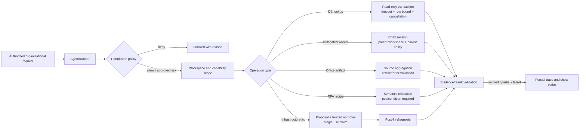

MCP Docker and clickhouse-cloud are deliberately excluded from this architecture. They are not project dependencies, configured servers, or acceptance targets.

---

## High-Level Architecture

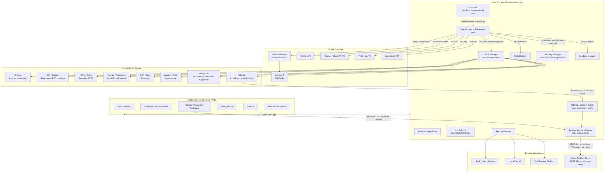

---

## Authentication Flows

Model providers (Gemini, OpenAI, Anthropic, OpenRouter) are authenticated via a plain **API key**, entered once in Settings -> API and stored encrypted (electron-store). Ollama needs no authentication at all. The one real OAuth flow in the app is for **Google Workspace** (Gmail/Drive/Calendar), which is separate from model access:

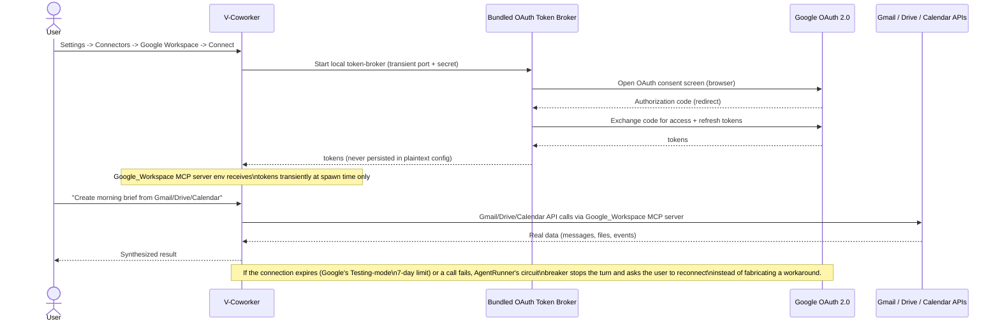

---

## Agent Execution Flow


---

## Orchestrator — Multi-Domain System Prompt & Role-Templated Sub-Agents

There is exactly one agent loop (`CoworkAgentRunner`) — it is not six separate agents. What makes it operate like a "Chief Orchestrator" is a dedicated `<orchestrator_operating_model>` block appended to its system prompt (`agent-runner.ts`), which names six domains and maps each to the real tool that already implements it, then states two operating rules: fall back to Infra_RCA/CLI when a GUI action keeps failing on what's really a config/data change, and never report a task complete without concrete verification (re-reading a generated file, re-running a diagnostic, or checking a GUI action's own verification result).

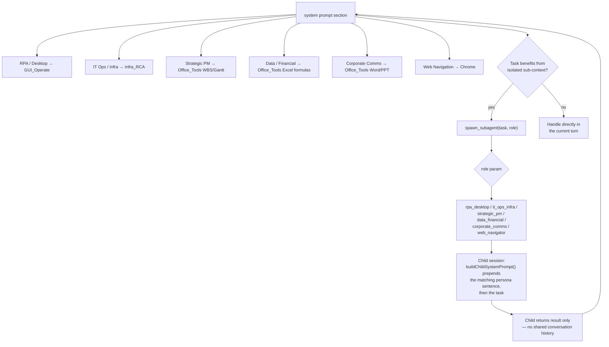

For the IT Ops domain specifically, self-verification is not just a prompt instruction — `infra_execute_fix` automatically re-runs `infra_diagnose` for the same category right after applying a fix (when the proposal carried one) and reports the fresh result as "Post-fix verification," so the agent has real evidence instead of trusting a clean exit code. See the Infra RCA section below.

`spawn_subagent` (`subagent-extension.ts`) itself is unchanged from a plumbing standpoint — same concurrency limit (3), same timeout bounds, same tool inheritance. The `role` parameter only changes what gets prepended to the child's system prompt; a spawn with no `role` behaves exactly as before (generic "focused sub-agent" prompt).

---

## MCP Tool Flow

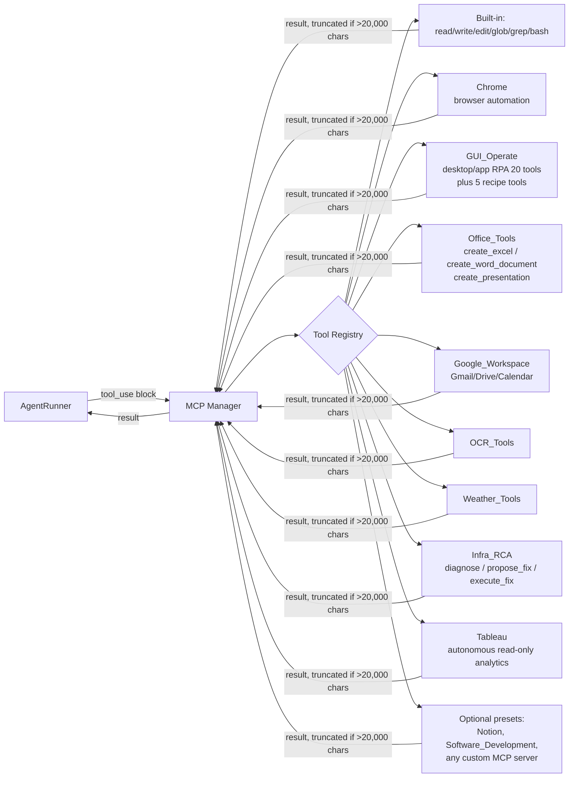

---

## Tableau Autonomous Analytics Flow

Tableau credentials remain in the encrypted Electron main-process store. The renderer and model-facing MCP child never receive the username or password. Both the dedicated analytics workspace and ordinary V-Coworker chat converge on the same read-only `TableauService` and autonomous planner.

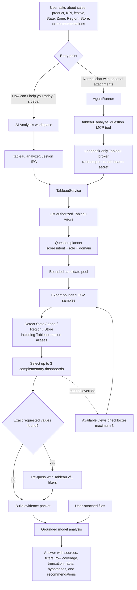

### Selection and evidence rules

- The planner ranks all authorized views by the user's question, selected V-Mart role/domain, dashboard metadata, export readability, and incremental geographic coverage. It chooses at most three dashboards.
- Retail defaults remain **Festive Performance** and **Business Performance** until a question requires more relevant evidence. Manual checkbox selection remains available and is capped at three views.
- Exact values observed in the selected exports can be reapplied through Tableau REST `vf_<field>` filters. Filters are bounded and read-only.
- State, Zone, Region, and Store aliases such as `ATTR(State Name)`, `Zone_Name`, `[Region]`, and `Store Name` are normalized. A governed filter that is configured in Tableau but absent from the current CSV is labelled **Configured**, not **Not available**.
- Exported samples are bounded and may be truncated. Every analysis packet carries the view identity, selection reason, applied filters, loaded/exported rows, truncation status, and geographic coverage.
- If files are attached to chat, the model must distinguish file evidence from Tableau evidence and reconcile period, grain, units, and metric definitions before comparing them.
- Recommendations are advisory. The connector cannot modify Tableau workbooks, data sources, permissions, or business systems.

### Tableau process boundaries

| Boundary                 | Contract and control                                                                                                                                                 |
| ------------------------ | -------------------------------------------------------------------------------------------------------------------------------------------------------------------- |
| Renderer -> main process | Typed IPC for config, status, view data, autonomous analysis, and opening Tableau. Password is accepted only on save and never returned.                             |
| MCP child -> broker      | Loopback HTTP with a random per-launch bearer secret. JSON requests are size-bounded and validated.                                                                  |
| Main process -> Tableau  | Tableau REST authentication, authorized view discovery, bounded CSV export, and exact `vf_` filtering. Credentials are redacted from errors and logs.                |
| Tableau -> model         | Only bounded, source-labelled data packets and calculated context; no Tableau credentials. Cloud-model use remains subject to the configured provider's data policy. |
| Model -> user            | Evidence-linked findings with filter context, coverage/truncation, explicit uncertainty, and separated facts, hypotheses, and recommendations.                       |

---

## Office Document Generation Flow

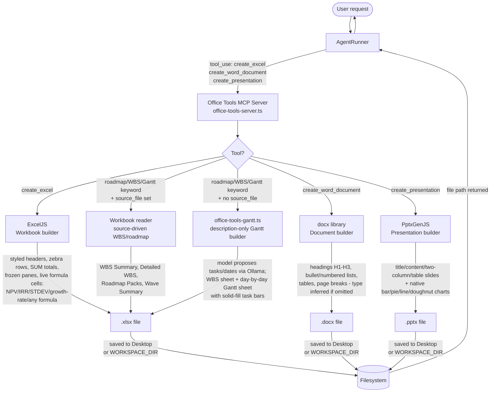

---

## macOS Native Addon Signing Flow

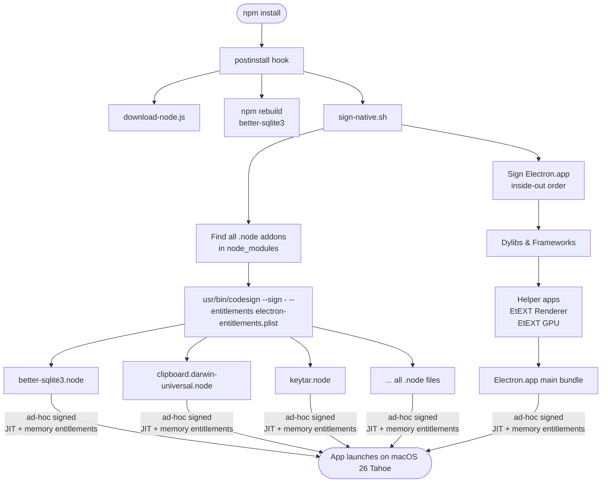

---

## Sandbox Isolation

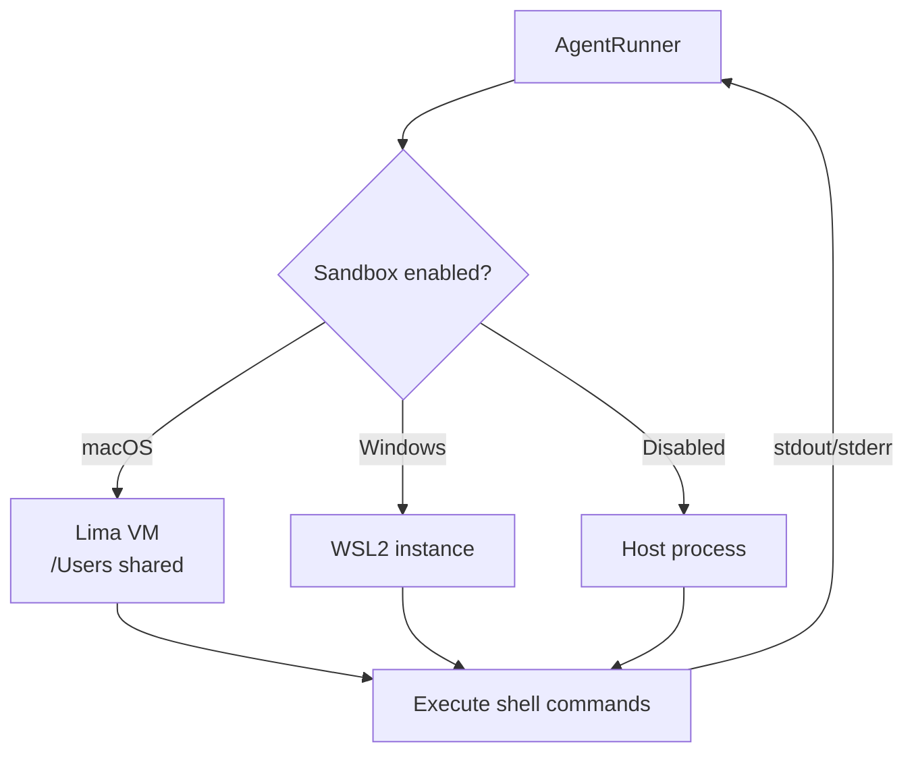

---

## Scheduled & Reactive Tasks

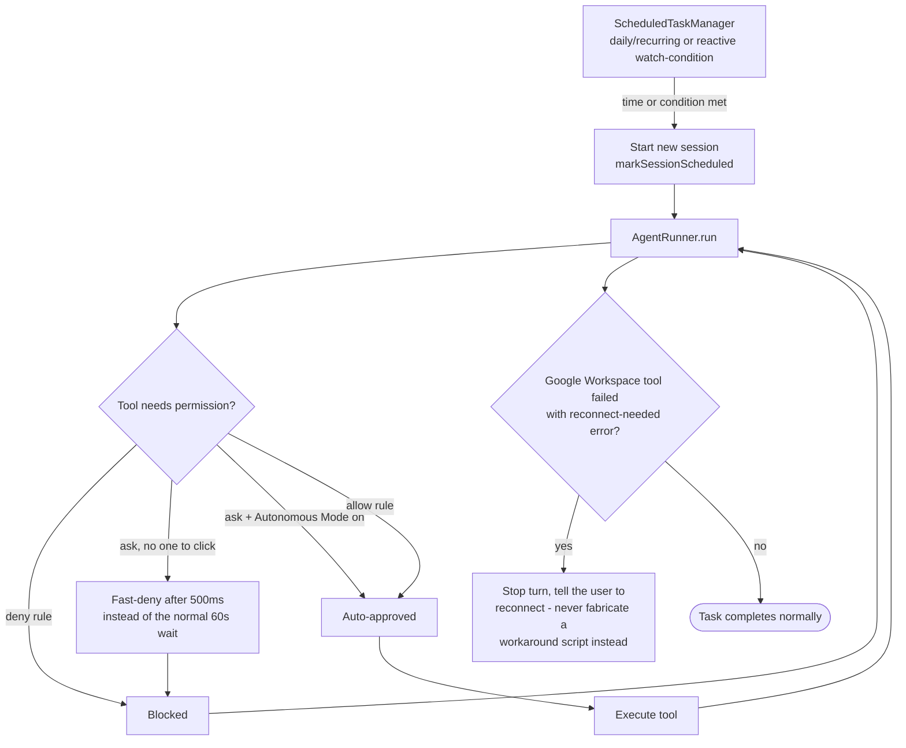

Unattended/scheduled sessions previously stalled on the same 60-second permission-dialog timeout designed for interactive clicks — nobody was present to answer, so every gated tool call silently failed after a full minute. Scheduled sessions now fail fast (500ms) instead, and Autonomous Mode lets a user opt in to skip the wait entirely for a given workflow, without ever touching the separate `deny` path.

---

## Infra RCA — Remote Infrastructure Diagnostics

Settings IPC and the MCP `infra_ping_check` tool share `checkInfraConnection`. It performs a bounded TCP connection for SSH/databases or a read-only SNMP request for network devices. Advanced WinRM checks inspect the selected OS route, probe the configured listener plus standard HTTP/HTTPS ports 5985/5986, use bounded RPC/SMB/RDP probes only to distinguish a reachable Windows host from an unavailable WinRM listener, and then perform an authenticated read-only WS-Man request. Results identify the first failing stage as route, host, TCP listener, TLS, authentication or ready. The UI exposes the evidence and controlled administrator repair commands without executing those changes. TCP success alone is explicitly not authentication evidence. The MCP tool marks failed readiness with `isError` so downstream runs cannot treat it as a successful check.

Host targets also expose a native remote-session launcher. It preflights the configured RDP (`3389`) or VNC (`5900`) port, then starts the platform client (`mstsc.exe`, macOS Screen Sharing/VNC URI, or installed Linux `xfreerdp`/Remmina/VNC viewer). It never passes passwords on the command line and reports launch success separately from authenticated session readiness; interactive control still depends on endpoint service configuration, OS permissions, consent and an unlocked desktop.

`Infra_RCA` is a bundled MCP server that diagnoses remote systems — Linux/Unix servers (SSH), Windows servers (WinRM/PowerShell with NTLM over HTTP/HTTPS, Basic restricted to HTTPS, and native Windows-ticket Kerberos), network gear/printers/UPS (SNMP via standard IETF MIBs), and Postgres/MySQL (direct connection) — and proposes fixes. The expert surface includes `infra_capabilities` and bounded `infra_expert_assess` quick/full runs across OS, service, process, CPU, disk/storage, memory, network, hardware, virtualization, security, printer, power and database health where the protocol supports it. It is implicitly enabled when no saved configuration exists; an explicitly disabled configuration takes precedence. Settings displays this effective configuration and provides an Enable/Disable control. Credentials for each named target live in a dedicated encrypted store and are resolved by the MCP server child process on demand via a loopback broker in the main process — they never appear in the model's context.

Bulk import accepts CSV or a JSON array, validates up to 10,000 records with shared batch defaults, and plans case-insensitive name matches. Preview returns only public fields and row errors. Commit revalidates against current storage and writes the entire resulting array once; any invalid record prevents a write. Existing IDs and omitted credentials survive updates, and changing an existing target's host/protocol requires a new target name. The UI supports non-secret target edits, including custom ports and WinRM transport/authentication; a blank password preserves the encrypted value. It pages 50 targets at a time; `infra_list_targets` returns a filtered page with a continuation offset. This is inventory onboarding, not a distributed monitoring or RPA-worker service.

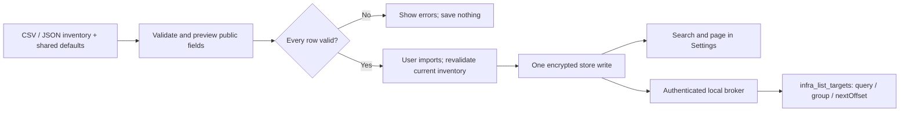

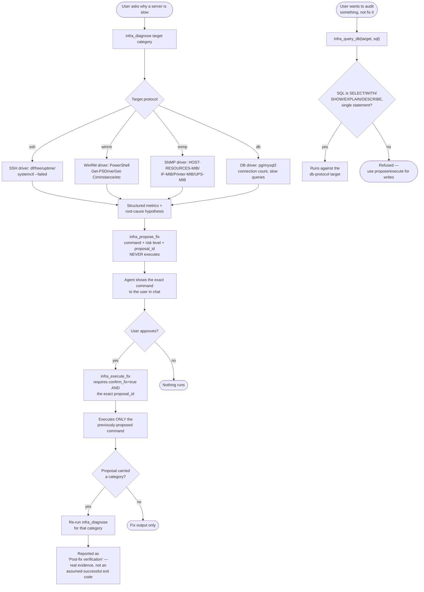

Two independent safety layers on `infra_execute_fix`, both inside the tool's own body (so — like GUI_Operate's `confirm_irreversible` — Autonomous Mode's permission-dialog bypass never reaches them): it refuses without `confirm_fix: true`, and it refuses unless `proposal_id` matches a real, unexpired proposal for that exact target — the model cannot substitute a different command than the one actually shown to the user. Read-only tools (`infra_list_targets`, `infra_diagnose`, `infra_propose_fix`, `infra_ping_check`, `infra_query_db`) default to `allow`; `infra_execute_fix` is deliberately left at the `ask` fallback on top of its own refusal.

`infra_query_db` gives the agent a lightweight way to run an ad-hoc read-only lookup against a `db` target without going through the propose/approve/execute ceremony meant for actual fixes — `assertReadOnlySelect()` in `db-driver.ts` rejects anything but a single SELECT/WITH/SHOW/EXPLAIN/DESCRIBE statement (including semicolon-stacked write attempts), so it's auto-allowed on the same footing as the other read-only tools; any actual data mutation still has to go through the gated fix flow.

DVR/camera (ONVIF) support is intentionally not built — no vendor/model was specified, and it's wired as a pluggable driver slot for later rather than guessed at.

---

## RPA Recipes — Record Once, Replay Reliably

RPA is opt-in through **Settings → MCP Connectors → RPA / Desktop automation → Enable RPA**. The card reuses an existing `GUI_Operate` configuration or creates the bundled preset, then saves through `mcp.saveServer`. The main process connects the server, discovers tools, and invalidates cached agent sessions. Disabling disconnects the connector; the saved disabled configuration persists across restarts. The card reports connection state and tool count, and refreshes the saved state after a connection failure.

`RpaWorkflowSetup` collects a business brief plus execution mode, encrypted credential-profile reference and autonomous trigger. Its embedded `RpaProcessStudio` lets an operator define ordered open-application/click/type/key/scroll/drag/wait steps, retain current-screen reference captures, list/delete executable recipes, or enter a guided agent recording. The shared example catalog covers every autonomous trigger with a one-time multi-stage Calculator calculation, daily ERP, weekly HRMS, repeating monitor and HTTP-triggered reconciliation drafts. The Calculator acceptance requires an independent read-back of the exact final value and treats focus, input, dialog, result and evidence failures as stopped runs. Installation is idempotent, preserves existing examples and creates neither recipes nor schedule entries. Example names and placeholder applications are explicit readiness blockers until an operator customizes and renames the draft. **Save workflow draft** writes the normalized definition to the encrypted `rpa-workflows` Electron store through typed preload IPC, then lets the operator reload or delete it; it never implies that a scheduled task exists. The stored definition contains only the credential-profile name; passwords remain in the separate encrypted credential store. Durable reference images live under the app user-data `rpa-process-assets` directory and can be removed only through a path-restricted IPC handler.

`rpa-process-studio.ts` validates and converts user-defined steps into the existing recipe schema. `launch_app` uses argument-safe platform launchers on macOS, Windows and Linux, then initializes the application RPA context. Every direct click requires semantic target identity; key combinations, waits, scrolls and normalized drags are bounded. Direct recipe creation never executes the steps. `buildRpaWorkflowPrompt` is the supervised recording contract; `buildRpaAutonomousRunPrompt` is a separate approved execution contract so scheduled runs call `run_recipe` without inheriting the recording approval gate. **Start guided recording in chat** reads retained images through a path-restricted, size-bounded IPC method and sends them as image content blocks with the instructions for initial sensing and supervised operation. **Create autonomous job** auto-saves defined steps when required, validates readiness and persists one-time, multi-slot daily, selected-day weekly, interval or HTTP change-triggered tasks through the scheduler. The scheduled agent invokes the saved recipe, resolves credentials inside the GUI connector, captures before/after evidence and reports postcondition status. Headless mode is explicitly rejected for GUI recipes; browser/API workflows must use their native tools.

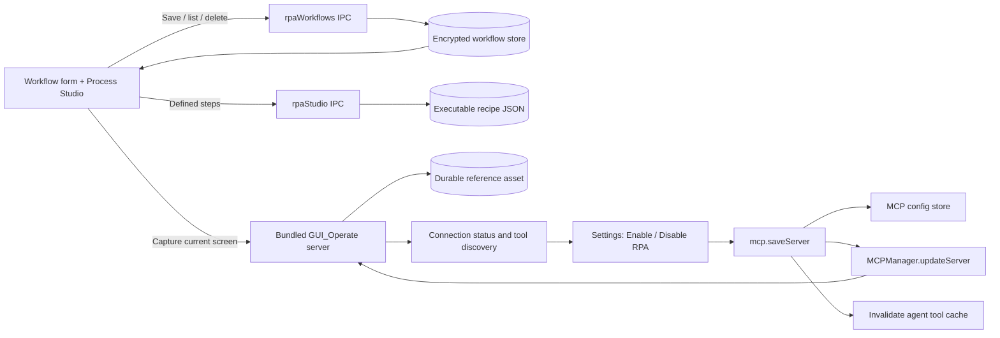

Five tools added to `GUI_Operate` turn its existing click/type/scroll/drag primitives into reusable automations for recurring tasks in any desktop app (ERP or otherwise): `start_recipe_recording`, `record_recipe_step`, `save_recipe`, `list_recipes`, `run_recipe`. `get_runtime_status` preflights the platform driver and reports missing dependencies or desktop-session restrictions. Recipes are stored as JSON with execution mode, opaque credential-profile reference, success check and ordered steps; no password is stored in recipe metadata.

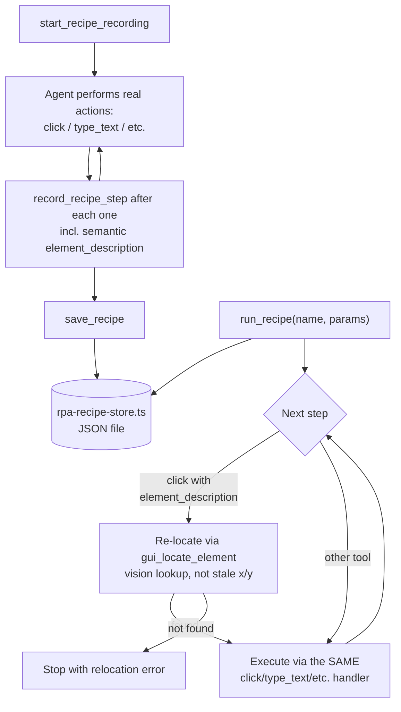

Replay captures an initial screenshot, re-resolves each `click` step semantically via the existing vision-based element locator, using the step's saved description ("the Save button"), and captures a final screenshot. It stops if relocation fails, a credential profile is missing, headless mode is requested for GUI steps, or a safety check blocks an action. Replay reuses the same tool handlers as live use, so `GUI_Operate`'s existing safety checks (irreversible-click confirmation, emergency stop, app denylist) also apply to recipe steps. The returned business postcondition is marked `requires_agent_verification`; the autonomous agent must read back the actual record/file/status before reporting success.

---

## Memory & Tool-Result Reliability Guardrails

Two related, previously-diagnosed failure modes and their fixes:

1. **Oversized tool results derailing the model.** A single MCP tool call (e.g. a full-page browser snapshot) could return 100,000+ characters of low-signal content in one turn. Landing that much noise right before the model's next decision reliably caused it to lose track of the actual task, regardless of which model or provider was used. `MCPManager.callTool()` now truncates any text block over 20,000 characters, generically, for every tool from every server — not special-cased to any one tool.
2. **Memory of past failures causing the model to skip trying.** If earlier sessions recorded a recurring task failing (e.g. an expired Google connection), the model would sometimes treat that history as still true and skip attempting the real tools this time — occasionally going as far as claiming to have completed an action it never took. The memory prompt now explicitly instructs the agent that past-failure entries are historical context only: it must still attempt the current request's real tools, and must never claim an action succeeded without actually invoking the corresponding tool and observing its result.

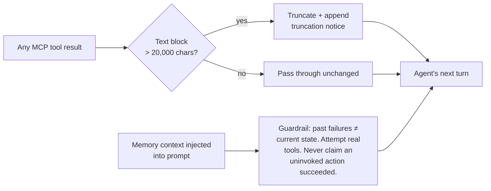

---

## Data & State

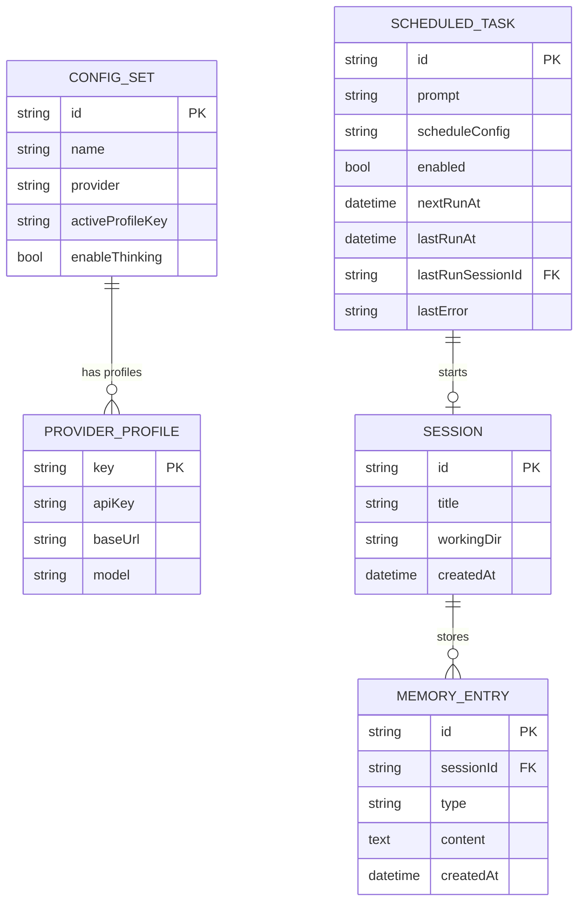

---

## Technology Stack

| Layer                 | Technology                                                                                                                  |
| --------------------- | --------------------------------------------------------------------------------------------------------------------------- |
| Desktop shell         | Electron 41                                                                                                                 |
| UI framework          | React 18 + Vite 7                                                                                                           |
| Styling               | Tailwind CSS 3                                                                                                              |
| State                 | Zustand                                                                                                                     |
| Local LLM             | Ollama + Gemma 4 (26b / e4b)                                                                                                |
| Cloud model providers | Gemini, OpenAI (ChatGPT), Anthropic, OpenRouter — API key auth                                                              |
| Google Workspace auth | Bundled OAuth token broker (Gmail/Drive/Calendar only, not model access)                                                    |
| IPC                   | Electron contextBridge (preload)                                                                                            |
| Persistence           | electron-store (encrypted) + SQLite (better-sqlite3, WAL mode)                                                              |
| MCP                   | @modelcontextprotocol/client + server                                                                                       |
| Office — Excel        | ExcelJS 4.4 (incl. live formula cells)                                                                                      |
| Office — Word         | docx 9.7                                                                                                                    |
| Office — PowerPoint   | PptxGenJS 4.0 (incl. native charts)                                                                                         |
| Desktop RPA           | GUI_Operate (custom, 20 tools + 5 recipe tools: runtime preflight/click/type/drag/scroll/vision/app-tracking/record-replay) |
| Browser automation    | chrome-devtools-mcp                                                                                                         |
| OCR                   | Tesseract (via OCR_Tools MCP server)                                                                                        |
| Weather               | Open-Meteo (via Weather_Tools MCP server)                                                                                   |
| Infra diagnostics     | ssh2, net-snmp, pg, mysql2, @netcuras/nodejs-winrm (via Infra_RCA MCP server)                                               |
| Sandbox (macOS)       | Lima VM                                                                                                                     |
| Sandbox (Windows)     | WSL2                                                                                                                        |
| Remote                | Slack Bolt SDK (+ other channel adapters) + ngrok + VNC                                                                     |
| Code signing          | /usr/bin/codesign (ad-hoc, entitlements plist)                                                                              |
| Language              | TypeScript 5                                                                                                                |

---

## Directory Map

```
src/
├── main/
│   ├── agent/          AgentRunner — streams LLM, dispatches tools,
│   │                   permission hook (Autonomous Mode aware),
│   │                   orchestrator system-prompt section, and
│   │                   subagent-extension.ts (role-templated spawn_subagent)
│   ├── config/         ConfigStore, auth-utils (Ollama + Gemini/OpenAI/
│   │                   Anthropic/OpenRouter API keys)
│   ├── google/         Google Workspace OAuth token broker
│   ├── mcp/            MCP server lifecycle, tool registry
│   │   ├── mcp-manager.ts          Server lifecycle, tool dispatch,
│   │   │                           oversized-result truncation
│   │   ├── gui-operate-server.ts   Desktop/app RPA (20 tools) + RPA
│   │   │                           recipe record/replay (5 tools)
│   │   ├── linux-desktop-driver.ts Linux X11/XWayland input, display,
│   │   │                           screenshot and runtime diagnostics
│   │   ├── rpa-recipe-store.ts     JSON store for recorded recipes
│   │   ├── office-tools-gantt.ts   Pure date/column math for the
│   │                           description-only Gantt builder
│   │   ├── office-tools-server.ts  Excel/Word/PPT generation (3 tools,
│   │   │                           incl. live Excel formulas)
│   │   ├── google-workspace-server.ts  Gmail/Drive/Calendar
│   │   ├── ocr-tools-server.ts     Tesseract OCR
│   │   ├── weather-tools-server.ts Open-Meteo weather
│   │   ├── infra-rca-server.ts     Remote diagnostics (8 tools, incl.
│   │   │                           read-only infra_query_db); propose/
│   │   │                           execute-fix split with auto post-fix
│   │   │                           verification, never auto-executes
│   │   ├── infra-drivers/          ssh/winrm/snmp/db/onvif diagnostic
│   │   │                           drivers (onvif is a stub — no named
│   │   │                           vendor yet)
│   │   ├── infra-rca-store.ts      Encrypted target credential store
│   │   └── infra-rca-broker.ts     Loopback broker resolving a target's
│   │                               secret by name — never via the model
│   ├── memory/         SQLite-backed memory (short + long term),
│   │                   untrusted-context + no-fabrication guardrails
│   ├── remote/         Slack (+ other channels), ngrok tunnel, VNC config
│   ├── sandbox/        Lima agent (macOS), WSL agent (Windows)
│   ├── skills/         Skill protocol loader & executor
│   ├── schedule/       Scheduled + reactive watch-condition agent runs
│   └── tools/          Tool executor wrappers
├── renderer/
│   ├── components/     All React UI components, incl. ModelSwitcher,
│   │                   settings/SettingsInfraRCA (target credential CRUD)
│   ├── store/          Zustand app state
│   ├── hooks/          Custom React hooks
│   └── i18n/           English locale (en.json)
└── shared/
    ├── ipc-types.ts    IPC channel type contracts
    └── api-model-presets.ts  Provider/model definitions

scripts/
├── bundle-mcp.js               esbuild bundles for MCP servers
├── sign-native.sh              Ad-hoc signing of .node addons (macOS 26)
└── electron-entitlements.plist JIT + memory entitlements for Electron
```

---

_V-Coworker — Developed by DSR AI Lab_
_github.com/dineshsrivastava07-cell/dsr-CoworkAI_
