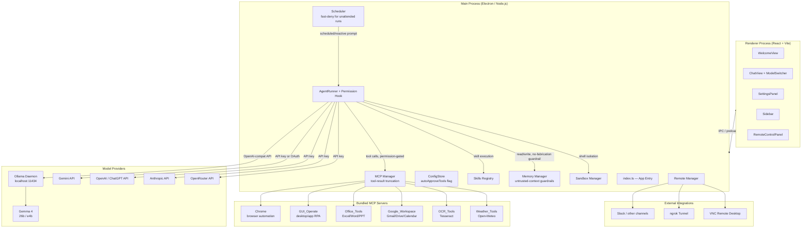
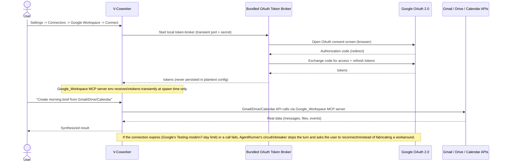
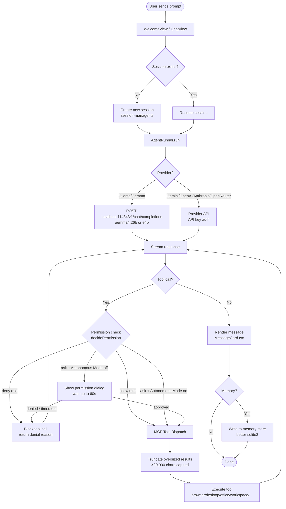
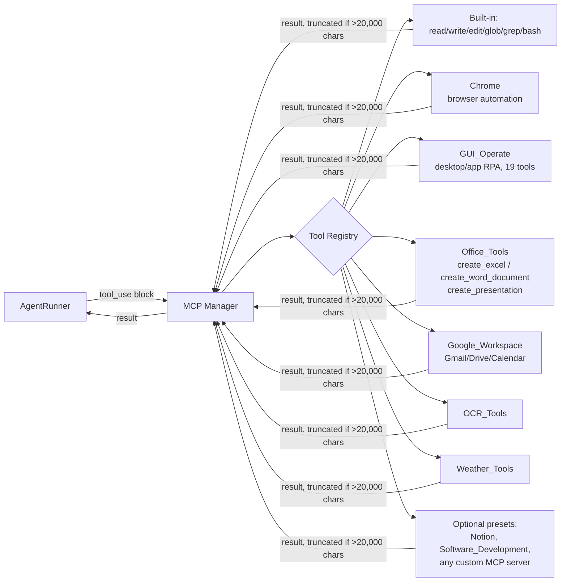
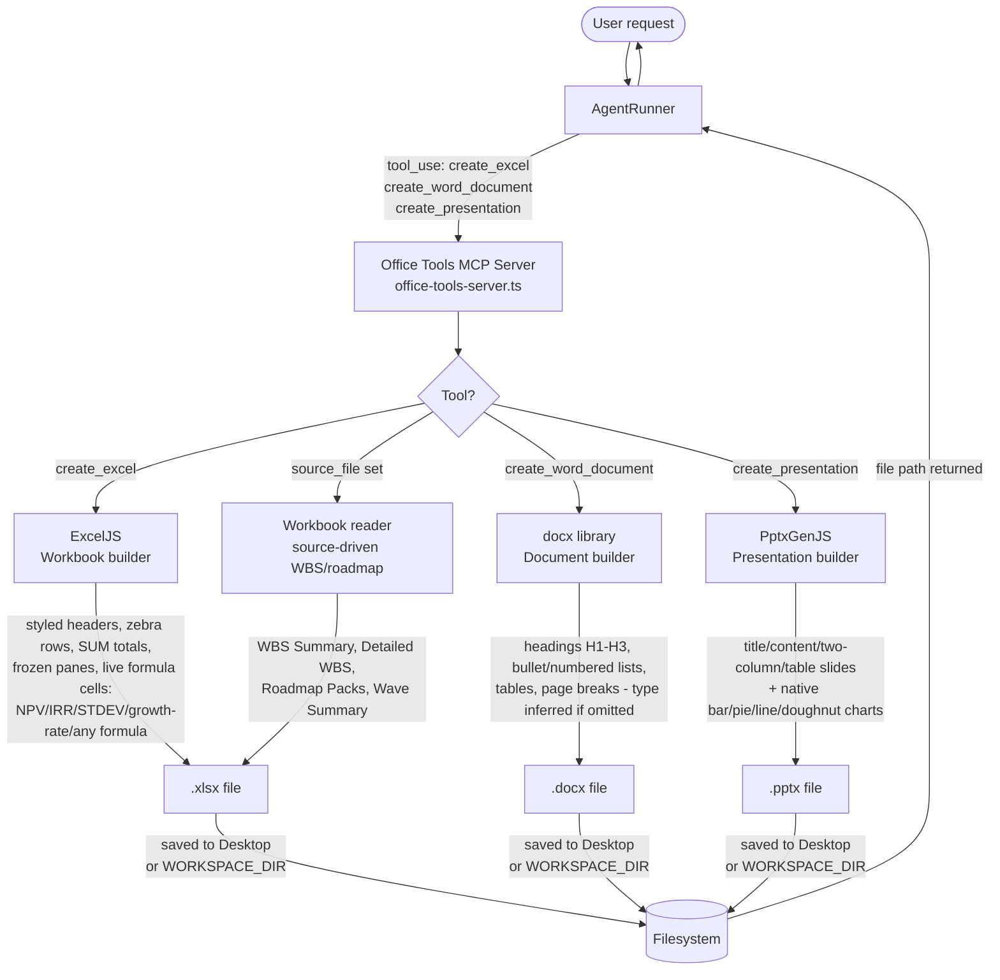
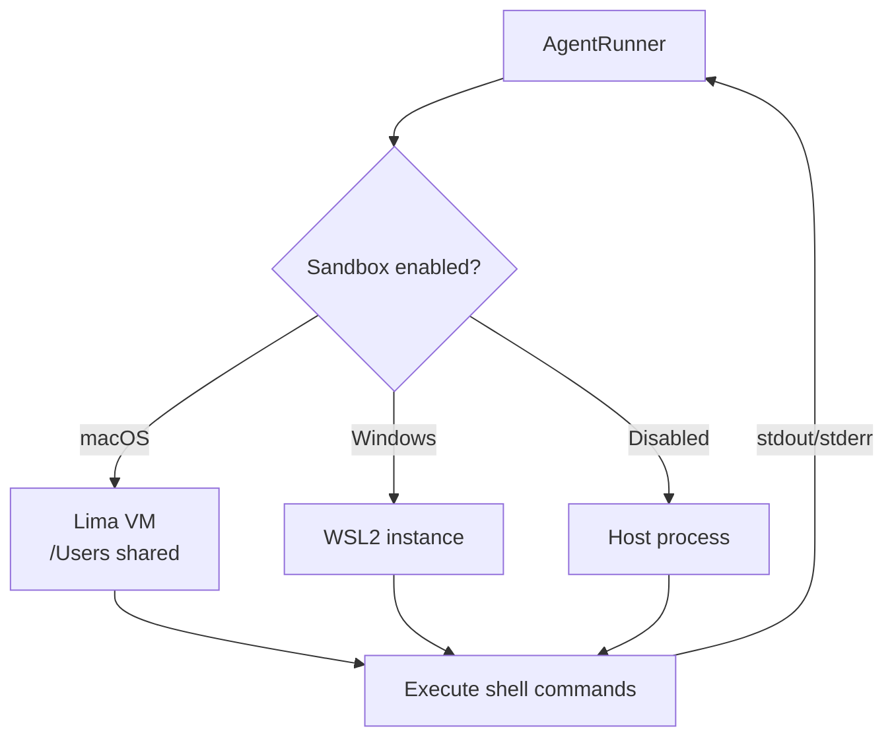
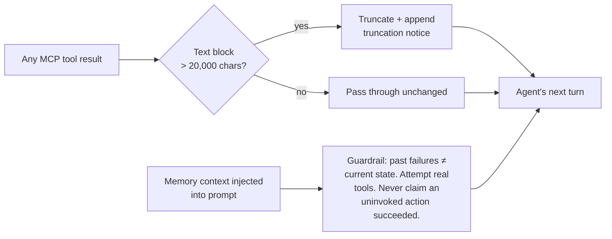
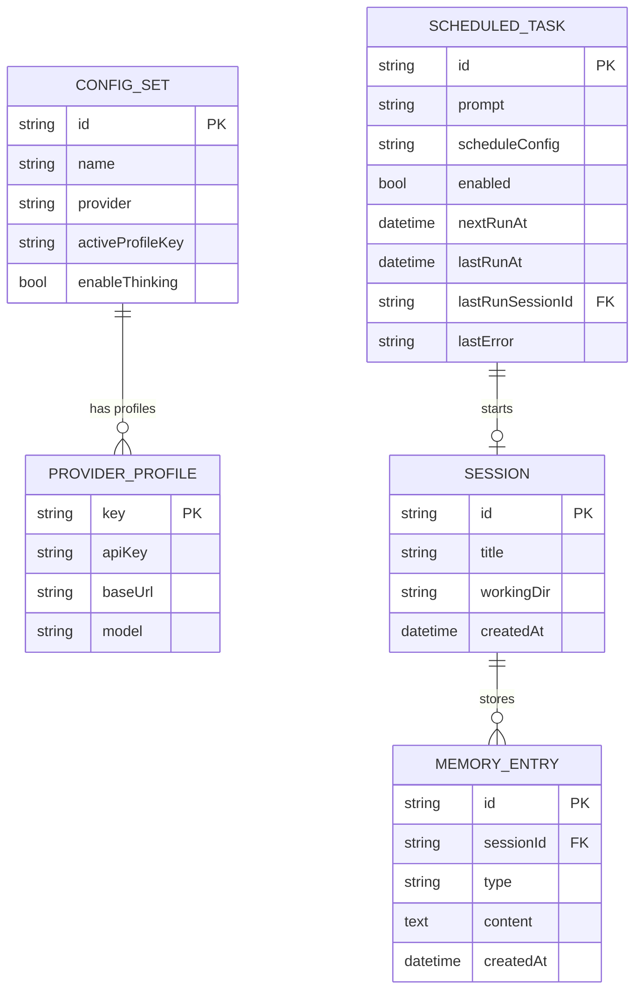

# V-Coworker — Architecture

> **Developed by DSR AI Lab**

---

## System Overview

V-Coworker is a local-first, autonomous agentic desktop application built on Electron + React. By default, all LLM inference runs on-device via **Ollama + Gemma**, with no cloud API key required. Users can switch to **Gemini, OpenAI (ChatGPT), Anthropic, or OpenRouter** at any time from the chat header or Settings. The architecture is organized into three primary layers — the Electron main process (Node.js), the React renderer (UI), and the model-provider layer — with a permission/autonomy layer and a bundled MCP tool ecosystem sitting between the agent loop and everything it can act on.

---

## High-Level Architecture



---

## Authentication Flows

Model providers (Gemini, OpenAI, Anthropic, OpenRouter) are authenticated via a plain **API key**, entered once in Settings -> API and stored encrypted (electron-store). Ollama needs no authentication at all. The one real OAuth flow in the app is for **Google Workspace** (Gmail/Drive/Calendar), which is separate from model access:



---

## Agent Execution Flow



---

## MCP Tool Flow



---

## Office Document Generation Flow



---

## macOS Native Addon Signing Flow


---

## Sandbox Isolation



---

## Scheduled & Reactive Tasks


Unattended/scheduled sessions previously stalled on the same 60-second permission-dialog timeout designed for interactive clicks — nobody was present to answer, so every gated tool call silently failed after a full minute. Scheduled sessions now fail fast (500ms) instead, and Autonomous Mode lets a user opt in to skip the wait entirely for a given workflow, without ever touching the separate `deny` path.

---

## Memory & Tool-Result Reliability Guardrails

Two related, previously-diagnosed failure modes and their fixes:

1. **Oversized tool results derailing the model.** A single MCP tool call (e.g. a full-page browser snapshot) could return 100,000+ characters of low-signal content in one turn. Landing that much noise right before the model's next decision reliably caused it to lose track of the actual task, regardless of which model or provider was used. `MCPManager.callTool()` now truncates any text block over 20,000 characters, generically, for every tool from every server — not special-cased to any one tool.
2. **Memory of past failures causing the model to skip trying.** If earlier sessions recorded a recurring task failing (e.g. an expired Google connection), the model would sometimes treat that history as still true and skip attempting the real tools this time — occasionally going as far as claiming to have completed an action it never took. The memory prompt now explicitly instructs the agent that past-failure entries are historical context only: it must still attempt the current request's real tools, and must never claim an action succeeded without actually invoking the corresponding tool and observing its result.



---

## Data & State



---

## Technology Stack

| Layer                 | Technology                                                                 |
| --------------------- | -------------------------------------------------------------------------- |
| Desktop shell         | Electron 41                                                                |
| UI framework          | React 18 + Vite 7                                                          |
| Styling               | Tailwind CSS 3                                                             |
| State                 | Zustand                                                                    |
| Local LLM             | Ollama + Gemma 4 (26b / e4b)                                               |
| Cloud model providers | Gemini, OpenAI (ChatGPT), Anthropic, OpenRouter — API key auth             |
| Google Workspace auth | Bundled OAuth token broker (Gmail/Drive/Calendar only, not model access)   |
| IPC                   | Electron contextBridge (preload)                                           |
| Persistence           | electron-store (encrypted) + SQLite (better-sqlite3, WAL mode)             |
| MCP                   | @modelcontextprotocol/client + server                                      |
| Office — Excel        | ExcelJS 4.4 (incl. live formula cells)                                     |
| Office — Word         | docx 9.7                                                                   |
| Office — PowerPoint   | PptxGenJS 4.0 (incl. native charts)                                        |
| Desktop RPA           | GUI_Operate (custom, 19 tools: click/type/drag/scroll/vision/app-tracking) |
| Browser automation    | chrome-devtools-mcp                                                        |
| OCR                   | Tesseract (via OCR_Tools MCP server)                                       |
| Weather               | Open-Meteo (via Weather_Tools MCP server)                                  |
| Sandbox (macOS)       | Lima VM                                                                    |
| Sandbox (Windows)     | WSL2                                                                       |
| Remote                | Slack Bolt SDK (+ other channel adapters) + ngrok + VNC                    |
| Code signing          | /usr/bin/codesign (ad-hoc, entitlements plist)                             |
| Language              | TypeScript 5                                                               |

---

## Directory Map

```
src/
├── main/
│   ├── agent/          AgentRunner — streams LLM, dispatches tools,
│   │                   permission hook (Autonomous Mode aware)
│   ├── config/         ConfigStore, auth-utils (Ollama + Gemini/OpenAI/
│   │                   Anthropic/OpenRouter API keys)
│   ├── google/         Google Workspace OAuth token broker
│   ├── mcp/            MCP server lifecycle, tool registry
│   │   ├── mcp-manager.ts          Server lifecycle, tool dispatch,
│   │   │                           oversized-result truncation
│   │   ├── gui-operate-server.ts   Desktop/app RPA (19 tools)
│   │   ├── office-tools-server.ts  Excel/Word/PPT generation (3 tools,
│   │   │                           incl. live Excel formulas)
│   │   ├── google-workspace-server.ts  Gmail/Drive/Calendar
│   │   ├── ocr-tools-server.ts     Tesseract OCR
│   │   └── weather-tools-server.ts Open-Meteo weather
│   ├── memory/         SQLite-backed memory (short + long term),
│   │                   untrusted-context + no-fabrication guardrails
│   ├── remote/         Slack (+ other channels), ngrok tunnel, VNC config
│   ├── sandbox/        Lima agent (macOS), WSL agent (Windows)
│   ├── skills/         Skill protocol loader & executor
│   ├── schedule/       Scheduled + reactive watch-condition agent runs
│   └── tools/          Tool executor wrappers
├── renderer/
│   ├── components/     All React UI components, incl. ModelSwitcher
│   ├── store/          Zustand app state
│   ├── hooks/          Custom React hooks
│   └── i18n/           English locale (en.json)
└── shared/
    ├── ipc-types.ts    IPC channel type contracts
    └── api-model-presets.ts  Provider/model definitions

scripts/
├── bundle-mcp.js               esbuild bundles for MCP servers
├── sign-native.sh              Ad-hoc signing of .node addons (macOS 26)
└── electron-entitlements.plist JIT + memory entitlements for Electron
```

---

_V-Coworker — Developed by DSR AI Lab_
_github.com/dineshsrivastava07-cell/dsr-CoworkAI_
