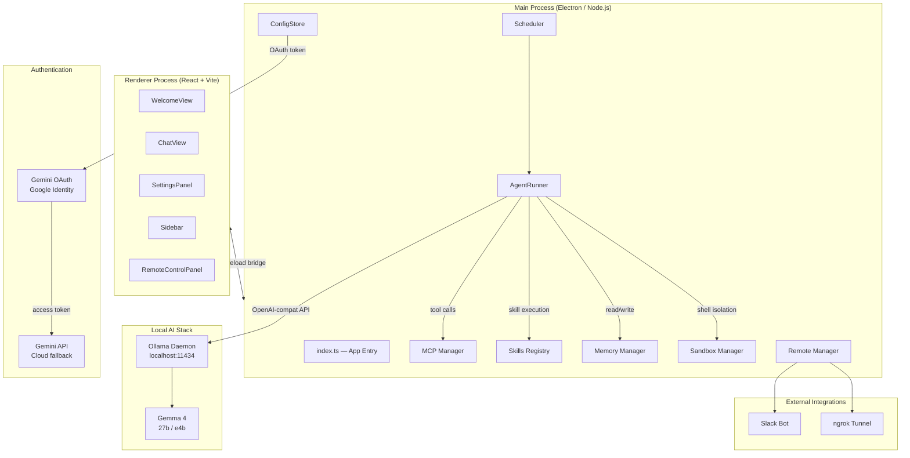
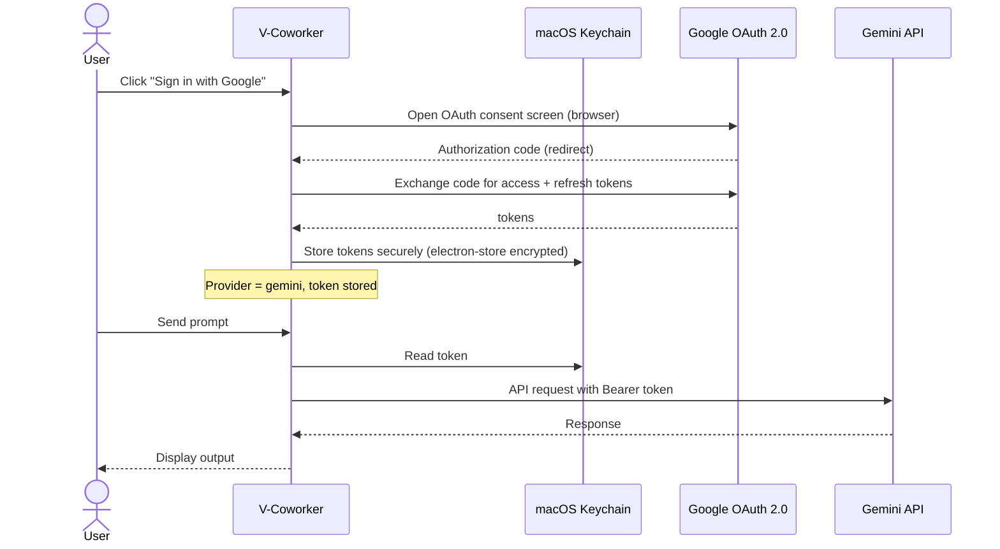
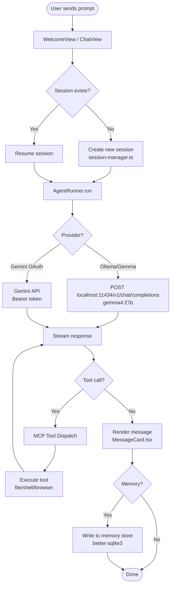
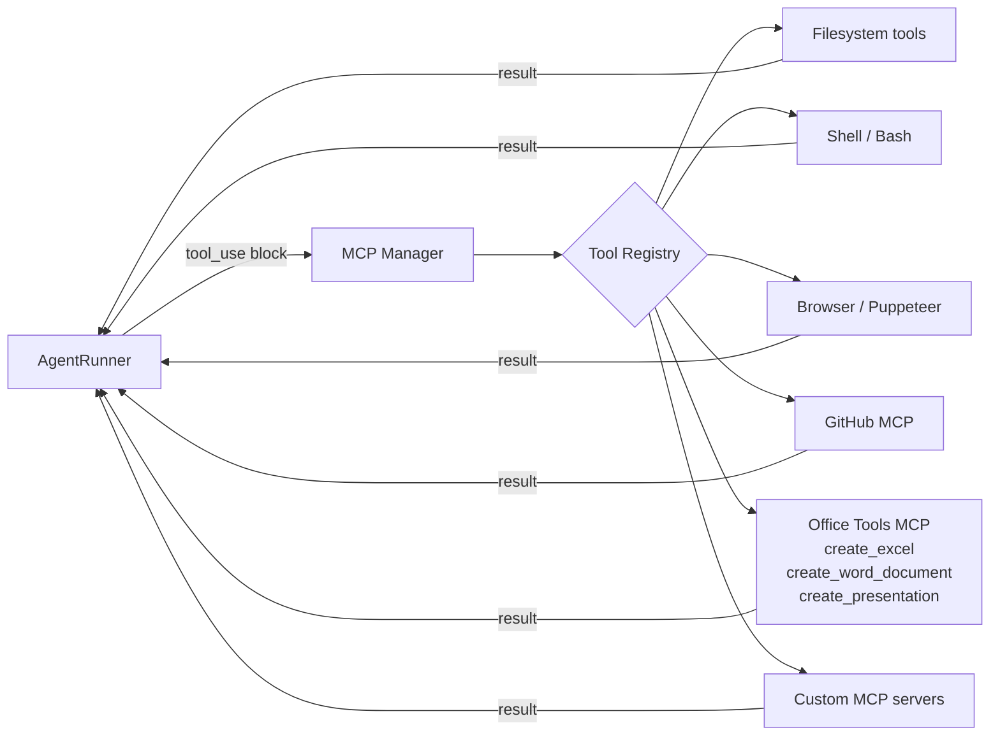
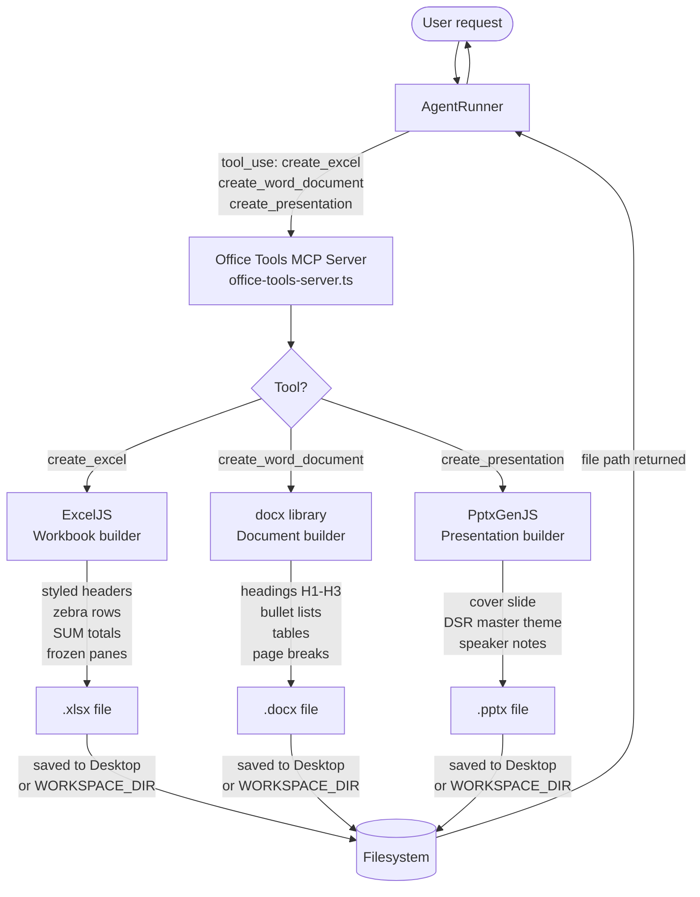
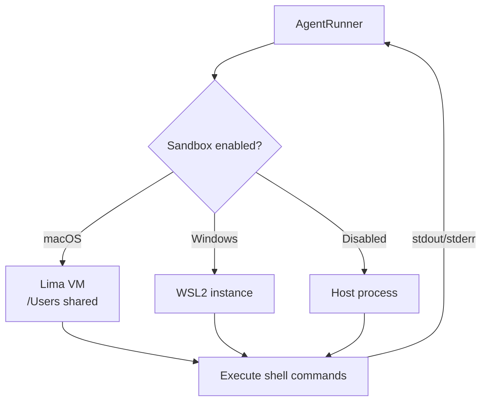
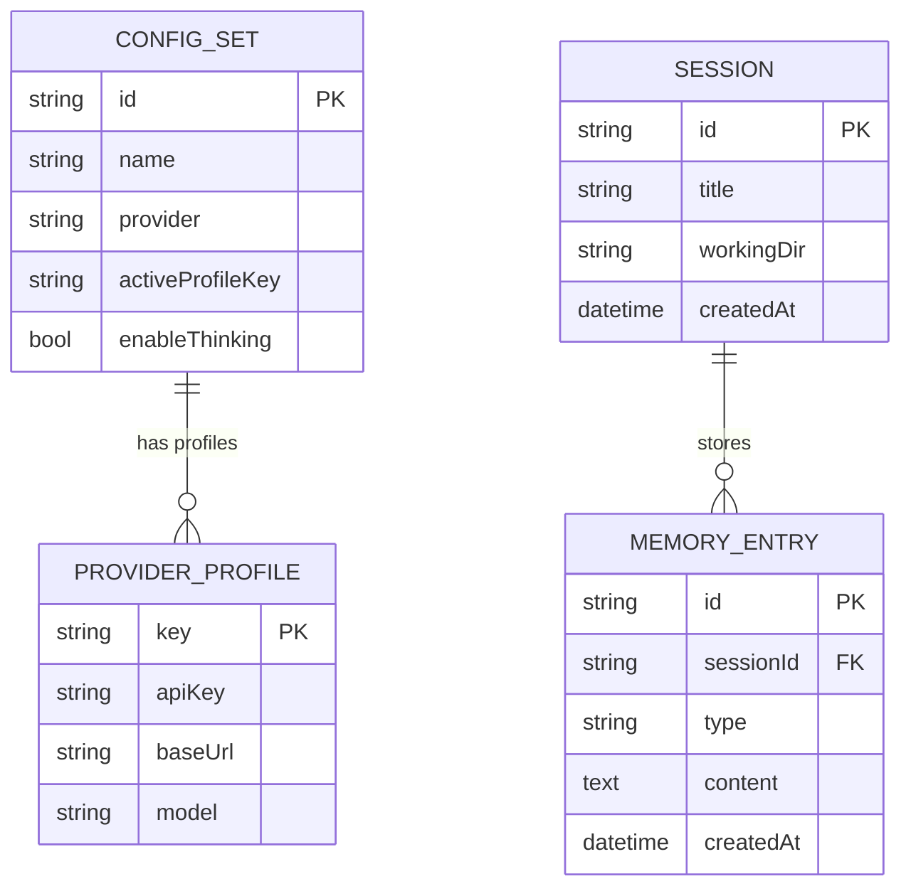

# V-Coworker — Architecture

> **Developed by DSR AI Lab**

---

## System Overview

V-Coworker is a local-shell AI agent desktop application built on Electron + React. All LLM inference runs on-device via **Ollama + Gemma**. Authentication uses **Gemini OAuth** (Google). The architecture is organized into three primary layers: the Electron main process (Node.js), the React renderer (UI), and the local AI infrastructure.

---

## High-Level Architecture



---

## Authentication Flow



---

## Agent Execution Flow



---

## MCP Tool Flow



---

## Office Document Generation Flow



---

## macOS Native Addon Signing Flow

```mermaid
flowchart TD
    NI([npm install]) --> PI[postinstall hook]
    PI --> DLN[download-node.js]
    PI --> REB[npm rebuild\nbetter-sqlite3]
    PI --> SGN[sign-native.sh]

    S001 --> FIND[Find all .node addons\nin node_modules]
    FIND --> SIGN[/usr/bin/codesign\n--sign - \n--entitlements electron-entitlements.plist]
    SIGN --> ADDON1[better-sqlite3.node]
    SIGN --> ADDON2[clipboard.darwin-universal.node]
    SIGN --> ADDON3[keytar.node]
    SIGN --> ADDONN[... all .node files]

    SGN --> EAPP[Sign Electron.app\ninside-out order]
    EAPP --> DY[Dylibs & Frameworks]
    DY --> HLP[Helper apps\nEtEXT Renderer\nEtEXT GPU]
    HLP --> MAIN2[Electron.app main bundle]

    ADDON1 & ADDON2 & ADDON3 & ADDONN & MAIN2 -->|ad-hoc signed\nJIT + memory entitlements| OK([App launches on macOS 26 Tahoe])
```

---

## Sandbox Isolation



---

## Data & State



---

## Technology Stack

| Layer               | Technology                                           |
| ------------------- | ---------------------------------------------------- |
| Desktop shell       | Electron 41                                          |
| UI framework        | React 18 + Vite 7                                    |
| Styling             | Tailwind CSS 3                                       |
| State               | Zustand                                              |
| Local LLM           | Ollama + Gemma 4 (27b / e4b)                         |
| Auth                | Gemini OAuth (Google Identity)                       |
| IPC                 | Electron contextBridge (preload)                     |
| Persistence         | electron-store (encrypted) + SQLite (better-sqlite3) |
| MCP                 | @modelcontextprotocol/client + server                |
| Office — Excel      | ExcelJS 4.4                                          |
| Office — Word       | docx 9.7                                             |
| Office — PowerPoint | PptxGenJS 4.0                                        |
| Sandbox (macOS)     | Lima VM                                              |
| Sandbox (Windows)   | WSL2                                                 |
| Remote              | Slack Bolt SDK + ngrok                               |
| Code signing        | /usr/bin/codesign (ad-hoc, entitlements plist)       |
| Language            | TypeScript 5                                         |

---

## Directory Map

```
src/
├── main/
│   ├── agent/          AgentRunner — streams LLM, dispatches tools
│   ├── config/         ConfigStore, auth-utils (Ollama + Gemini OAuth)
│   ├── mcp/            MCP server lifecycle, tool registry
│   │   ├── mcp-manager.ts          Server lifecycle + tool dispatch
│   │   ├── gui-operate-server.ts   GUI automation (29 tools)
│   │   └── office-tools-server.ts  Office doc generation (3 tools)
│   ├── memory/         SQLite-backed memory (short + long term)
│   ├── remote/         Slack channel, ngrok tunnel
│   ├── sandbox/        Lima agent (macOS), WSL agent (Windows)
│   ├── skills/         Skill protocol loader & executor
│   ├── schedule/       Cron-based scheduled agent runs
│   └── tools/          Tool executor wrappers
├── renderer/
│   ├── components/     All React UI components
│   ├── store/          Zustand app state
│   ├── hooks/          Custom React hooks
│   └── i18n/           English locale (en.json)
└── shared/
    ├── ipc-types.ts    IPC channel type contracts
    └── api-model-presets.ts  Provider/model definitions

scripts/
├── bundle-mcp.js               esbuild bundles for MCP servers
├── sign-native.sh              Ad-hoc signing of .node addons (macOS 26)
└── electron-entitlements.plist JIT + memory entitlements for Electron
```

---

_V-Coworker — Developed by DSR AI Lab_
_github.com/dineshsrivastava07-cell/dsr-CoworkAI_
