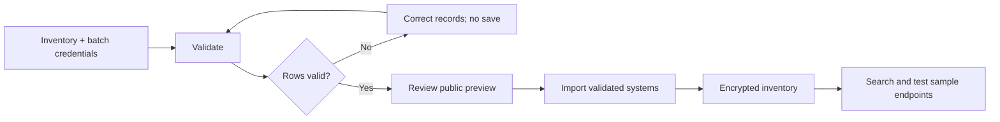

# V-Coworker IT user guide: RPA and Infra RCA

**Audience:** IT administrators, infrastructure support, automation operators and application owners.

**Product baseline:** the bulk inventory and guided RPA setup features introduced in commit `9d1c0cc`.

**Guide checked:** 15 September 2026. The in-app feature is named **Infra RCA** (root cause analysis), sometimes referred to as “Infra ICA”.

This guide describes the current Electron desktop application. Updating GitHub source does not update an already installed application; use an IT-approved build containing these features and restart that build before following the steps.

## Contents

1. [Purpose and supported scope](#1-purpose-and-supported-scope)
2. [Prepare the workstation and accounts](#2-prepare-the-workstation-and-accounts)
3. [Settings and connection states](#3-settings-and-connection-states)
4. [Configure Infra RCA](#4-configure-infra-rca)
5. [Run diagnostics and review proposed fixes](#5-run-diagnostics-and-review-proposed-fixes)
6. [Configure RPA](#6-configure-rpa)
7. [Record, replay and verify a process](#7-record-replay-and-verify-a-process)
8. [Schedules and daily operation](#8-schedules-and-daily-operation)
9. [Troubleshooting](#9-troubleshooting)
10. [IT acceptance tests](#10-it-acceptance-tests)
11. [Logs, support and recovery](#11-logs-support-and-recovery)
12. [Templates and engineering checks](#12-templates-and-engineering-checks)

## 1. Purpose and supported scope

| Capability          | What it does                                                                            | What setup alone does not establish                                                            |
| ------------------- | --------------------------------------------------------------------------------------- | ---------------------------------------------------------------------------------------------- |
| Infra RCA inventory | Stores named SSH, WinRM, SNMP and database targets, including credentials               | Connectivity, valid login, diagnostic privileges or continuous monitoring                      |
| Bulk import         | Validates CSV/JSON and saves up to 10,000 systems per batch                             | Automatic discovery or deployment of workers to those computers                                |
| Infra RCA connector | Gives the agent tools to discover configured targets, diagnose and propose fixes        | Permission to apply every proposal                                                             |
| RPA connector       | Makes desktop input, screenshots, vision and recipe tools available                     | A process definition for each ERP, HRMS or desktop application                                 |
| RPA workflow form   | Persists the business definition, parameters, reference captures and autonomous trigger | Proof that the recipe works against the intended application                                   |
| RPA Process Studio  | Builds an executable recipe from defined steps or starts a guided agent recording       | A passive global recording of unrelated mouse, keyboard or screen activity                     |
| Desktop recipe      | Stores supported desktop actions for named replay                                       | Browser/API action recording, distributed execution or a domain-specific correctness guarantee |

**Terms:** a _target_ is one configured infrastructure endpoint; a _connector_ is the tool service; a _workflow_ is the business process; a _recipe_ is its recorded desktop-action sequence; a _success check_ confirms the actual business result after execution.

Docker MCP and clickhouse-cloud MCP are outside this project's setup and test scope. They are not prerequisites for either feature.

## 2. Prepare the workstation and accounts

1. Confirm the app build contains **Bulk import systems (CSV / JSON)** and **Configure a business workflow**. If either is missing, stop and update the app through your IT deployment process.
2. Choose a writable working folder for test outputs. Keep test outputs separate from operational reports.
3. Open **Settings → API**. Select your approved provider/model, save the settings, and use the available connection test. Send a short chat request to verify a real response.
4. For visual RPA, select a provider/model that can actually process images through the configured connector route. A successful text-chat test is not a vision test; perform RPA-02 and RPA-03 below.
5. Obtain the inventory, protocol/port details, network or VPN access, and appropriately scoped accounts from the infrastructure owner.
6. Obtain a test account/tenant and approved sample data from the ERP/HRMS/application owner. Ask the owner what output proves correctness.
7. Agree who reviews results and who can approve changes. Keep normal tool approval prompts during initial testing. **Autonomous Mode is not required to enable either connector.**

### Protocol preparation

| Target                         | Protocol value | Default port  | Preparation and current limits                                                                                                                                                                                                                                        |
| ------------------------------ | -------------- | ------------- | --------------------------------------------------------------------------------------------------------------------------------------------------------------------------------------------------------------------------------------------------------------------- |
| Linux/Unix                     | `ssh`          | TCP 22        | Account plus password or private-key contents; verify access to the required diagnostic commands                                                                                                                                                                      |
| Windows                        | `winrm`        | TCP 5985/5986 | Supports NTLM over HTTP/HTTPS and Basic over HTTPS; Kerberos uses the Windows V-Coworker host's domain ticket. Select the transport and authentication mode explicitly and keep certificate verification enabled unless an approved internal CA policy says otherwise |
| Switch, router, printer or UPS | `snmp`         | UDP 161       | SNMP v2c community and permission to read the required standard MIBs; SNMPv3 and arbitrary vendor-specific diagnostics are not provided by this driver                                                                                                                |
| PostgreSQL                     | `db`           | TCP 5432      | `dbEngine=postgres`, database name and account; use read-only database privileges for diagnosis                                                                                                                                                                       |
| MySQL                          | `db`           | TCP 3306      | `dbEngine=mysql`, database name and account; use read-only database privileges for diagnosis                                                                                                                                                                          |

Ports are connection defaults, not instructions to open firewall rules. Obtain any network or service changes through your normal IT process. Changing a port alone does not add unsupported authentication or TLS behavior.

## 3. Settings and connection states

| Setting                 | Location                                                 | Operator action                                                                                           |
| ----------------------- | -------------------------------------------------------- | --------------------------------------------------------------------------------------------------------- |
| Provider/model          | **Settings → API**                                       | Save and test the approved configuration                                                                  |
| Infra RCA connector     | **Settings → MCP Connectors → Infra RCA**                | Enable/disable and inspect status; expand the card for targets                                            |
| RPA connector           | **Settings → MCP Connectors → RPA / Desktop automation** | Enable/disable; expand the workflow form                                                                  |
| Browser connector       | **Settings → MCP Connectors → Quick Add Presets**        | Add **Chrome**, then enable its connector if disabled; verify its connection before browser-specific work |
| Automatic tool approval | **Settings → General → Autonomous Mode**                 | Leave off during initial acceptance; enabling it is not a substitute for process validation               |
| Scheduled runs          | **Settings → Schedules**                                 | Configure timing, prompt and working directory after supervised acceptance                                |
| Diagnostics             | **Settings → Logs**                                      | Inspect the shown log folder or choose **Export Diagnostics**                                             |

| Displayed state                            | Meaning                                                                        | Next step                                                                           |
| ------------------------------------------ | ------------------------------------------------------------------------------ | ----------------------------------------------------------------------------------- |
| Disabled                                   | The saved connector is off                                                     | Click its Enable control if this is the intended service                            |
| Connecting / enabled but not connected     | Enablement was requested, but no usable connection is confirmed                | Wait for status refresh; if it persists, inspect the error banner and logs          |
| Connected with tool count                  | The tool server is connected and its tools were discovered                     | Run a read-only smoke test; external applications/systems may still be inaccessible |
| Connection failed, or returned to Disabled | The connection attempt failed; enabled configuration may have been rolled back | Capture the error, correct the cause, then retry Enable                             |

An implicitly enabled built-in and an explicitly disabled saved connector are different states. Infra RCA honors an explicit disabled configuration. Adding targets does not override it. The current server exposes **8 Infra RCA tools**, including `infra_ping_check`, `infra_capabilities`, and `infra_expert_assess`; do not rely only on counts after later releases.

## 4. Configure Infra RCA

### 4.1 Enable the connector

1. Open **Settings → MCP Connectors**.
2. Find **Infra RCA** and inspect the status below its heading.
3. If disabled, click **Enable Infra RCA**.
4. Wait for **Connected** and a tool count.
5. Start a chat and ask: `List configured infrastructure targets. Do not diagnose or change anything.`
6. Expect an empty inventory or your existing targets, with no credential fields in the result. A tool error means the connector/broker is not ready; follow section 9.

### 4.2 Add one simple target

1. Expand the **Infra RCA** card and click **Add target**.
2. Enter a unique **Name**, select **Protocol**, and enter **Host** without `https://`, paths or a combined `host:port` value. Use the separate optional **Port** field for a custom listener; IPv6 literals naturally contain colons.
3. For SSH/WinRM/database targets, enter **Username** and **Password**. For SNMP, enter **SNMP community string**. For databases, select **Database engine**. For WinRM, choose **Authentication** (`Auto`, `Basic`, `NTLM`, or `Kerberos`) and **Transport** (`HTTP`/`HTTPS`); use `DOMAIN\\user` or `user@domain` for NTLM/Kerberos. Kerberos uses the signed-in Windows V-Coworker ticket and does not use the password field. Basic authentication is accepted only over HTTPS.
4. Click **Save target** and verify the name and host in the list.
5. Click **Test** and interpret its limited result as described in section 5.

Use the pencil button to edit a saved target. Leaving the password blank while editing preserves its existing encrypted password. Protocol changes remain disabled in the edit form; create a replacement target when the protocol changes. Use a **one-row bulk import** for a database name or SSH private key/passphrase. Leaving the SSH password blank does not automatically select a key from your machine.

### 4.3 Prepare and import hundreds or thousands of targets

1. Download [infra-targets.csv](user-guide-templates/infra-targets.csv) or [infra-targets.json](user-guide-templates/infra-targets.json). The sample addresses are for documentation; replace them before attempting connections.
2. In Excel, keep the exact CSV headers. Assign a unique `name` to each endpoint and a `group` such as `Mumbai-Production`, `Delhi-Network` or `HRMS-Test`.
3. Group the inventory by credential set. For 1,000+ systems, start with one representative system per protocol/site, then a small batch, before importing the remaining inventory.
4. Save the workbook as **CSV UTF-8**. Upload `.csv` or a JSON array in `.json`; `.xlsx` files are not accepted directly.
5. Open **Infra RCA → Bulk import systems (CSV / JSON)** and choose the file under **Inventory file**. Check the **Format** and **Inventory content** fields.
6. Set **Default protocol** to the intended protocol, or **Use inventory / saved value** when rows supply it or updates must preserve it.
7. Fill **Group / site**, **Shared username**, **Shared password**, **SNMP community**, and **Default database engine** only where those defaults apply to this batch. Expand **Shared SSH private key** when needed; paste the key contents, not a filename.
8. Leave credentials out of inventory files when the shared controls are sufficient. Non-empty row values override shared defaults. Do not paste an inventory containing credentials into chat or commit it to GitHub.
9. Choose **Skip existing targets** for initial onboarding or an idempotent reimport.
10. Click **Validate inventory**. Review total/add/update/skip/invalid counts. Preview does not save data; it shows up to 100 valid records and the first 50 row errors without returning credential fields.
11. Correct all applicable validation errors and validate again. Blank optional cells inherit values; they do not clear credentials.
12. Click **Import validated systems**. Expect the success message with added/updated/skipped counts, then confirm the saved targets and groups.
13. Search by name, host, protocol or group. Use **Previous / Next** to move through pages of 50 systems.
14. Run the connectivity and diagnostics tests below on representative endpoints. Import success is not a fleet-health result.

Maximum input is **10,000 records and 5 MB per batch**. CSV supports quoted commas, escaped quotes, CRLF and quoted multiline values. Duplicate names within the inventory are rejected. Unknown or duplicate column names are rejected. Matching against saved names ignores case.



### 4.4 Update groups or rotate credentials

1. Prepare only the target names that should change. Retain their existing hosts and protocols.
2. Choose **Update existing targets (same host and protocol)**.
3. Set **Default protocol** to **Use inventory / saved value** unless explicitly replacing a missing per-row value. Remove unrelated shared defaults to avoid overwriting saved fields.
4. Enter the intended changed group or credentials; leave unrelated optional fields blank.
5. Validate and confirm that intended records show **update**, not **add**.
6. Import, then authenticate to one approved sample endpoint from every affected credential group.

Updates preserve target IDs. A host/protocol change requires a new target name. A saved private key takes precedence over a password in the SSH driver; do not assume a password update switches a key-based record to password authentication. Blank imports cannot clear saved keys. Use a new target record for an authentication-method change, test it, and remove the retired record only after review.

Shared credentials are copied to individual encrypted records. There is no centrally linked credential profile or vault rotation integration in this interface.

### 4.5 Retire a target

1. Identify dependent schedules and disable future runs that reference the retired name.
2. Confirm the exact target name/host in Settings.
3. Use that target's trash icon to remove its local configuration. This does not delete or modify the remote system. The current target-delete control has no separate confirmation dialog.
4. Refresh/search and confirm the target is absent. Update any workflow instructions that used its name.

## 5. Run diagnostics and review proposed fixes

### 5.1 Separate the three connectivity checks

1. **Connector check:** confirm **Connected** and successfully list targets.
2. **Network/protocol check:** click **Test** for the target. **TCP reachable (login not tested)** means a socket opened for SSH, WinRM or a database; it does not prove authentication. **SNMP responded** means a read-only SNMP request returned system information.
3. **Diagnostic check:** ask the agent to run the requested read-only health category on that exact target and compare its result with a known baseline.

Example:

```text
Run read-only disk_health diagnostics on mum-linux-001.
State the target, protocol, measurement time, metrics and errors.
Compare the result with the baseline I provide. Do not apply a fix.
```

If a command fails or a response has no usable metrics, record the test as failed or unverified. An agent's summary alone is not evidence that all diagnostic commands succeeded.

### 5.2 Find targets across a large fleet

```text
List the Mumbai-Production group. Continue through every page until
nextOffset is null. Report the total and names. Do not run diagnostics.
```

`infra_list_targets` accepts `query`, exact `group`, `offset`, and `limit` (default 50, maximum 100). Check that collected names match the reported total. For subsequent diagnostics, request a defined target list and category; do not interpret a returned discovery page as a completed fleet scan.

### 5.3 Review a proposed fix

1. Review the diagnosis and the exact target, command, explanation and risk in the proposal.
2. Establish the maintenance window and recovery procedure with the system owner before approving a modifying operation.
3. Approve or deny the specific proposal in the application's conversation/permission flow. A copied `confirm_fix: true` string is not a substitute for trusted approval.
4. Inspect the actual tool result. A proposal can expire or become invalid; request a fresh proposal if required.
5. Compare post-fix diagnostics with the baseline. If no post-fix check ran, request an appropriate read-only check.
6. If execution times out or the result is uncertain, inspect the target state before retrying. Do not assume that a timeout means nothing happened.

## 6. Configure RPA

### 6.1 Enable and establish basic readiness

1. Open **Settings → MCP Connectors → RPA / Desktop automation**.
2. Click **Enable RPA** and wait for **Connected**.
3. Confirm the intended provider/model under **Settings → API**.
4. Sign in to the test application manually for the first recording, or save an encrypted RPA credential profile in the workflow form. Confirm the correct tenant, account, window and, for remote sessions, remote host.
5. On macOS, open **System Settings → Privacy & Security → Accessibility** and allow the application that actually runs the automation. A source development launch may appear as Electron; a packaged build may show its app name. Follow any additional permission prompt for the actual helper process. [Apple accessibility instructions](https://support.apple.com/en-au/guide/mac-help/mh43185/mac).
6. In **Privacy & Security**, review **Screen & System Audio Recording** (called Screen Recording on some macOS versions), allow the app's screen access, and follow any restart prompt. [Apple screen recording instructions](https://support.apple.com/en-au/guide/mac-help/mchl592e5686/mac).
7. In chat, request: `Use get_runtime_status, then get_displays, and report readiness and available displays. Do not click or type.` Resolve every missing prerequisite and confirm the intended display.
8. Request a fresh screenshot of the test app, then ask `gui_verify_vision` a known question about a visible label. This separately tests screen capture and the configured vision route. Do not request a click until these checks pass.

For Windows, use an available interactive desktop and a test app the current user can operate. Do not assume an elevated window, lock screen, secure credential dialog or remote-session boundary is controllable just because the connector is Connected.

For Linux, launch V-Coworker in the signed-in graphical user session. The connector supports X11 and XWayland when `DISPLAY` is available and host policy allows synthetic input. Install the organization-approved packages that provide `xdotool`, `xrandr`, and one screenshot backend (`maim`, `scrot`, or `gnome-screenshot`). Run `get_runtime_status` to verify the detected backends. Native Wayland protected surfaces may reject global capture/input; use an approved desktop portal or an X11/XWayland execution session where organizational policy permits it.

### 6.2 Select the appropriate application route

| App/task type               | Configure/use                                                                       | Verification focus                                                           |
| --------------------------- | ----------------------------------------------------------------------------------- | ---------------------------------------------------------------------------- |
| Web ERP or HRMS             | Enable the configured browser connector; use page elements/locators where available | Correct tenant, record ID, status, dates, row counts and downloaded artifact |
| Native desktop app          | GUI_Operate, the correct app context and display, semantic target descriptions      | The intended field/window and the saved result                               |
| Remote Desktop/Citrix       | The visible remote-client window, connected to the intended host                    | Remote identity, resolution, session availability and remote output path     |
| Structured file/Office work | Applicable file/Office tools where available                                        | Reopen files and verify formulas, totals and data completeness               |

For websites, use current page elements and state checks instead of assuming a saved screen coordinate is still correct. Locator resolution and actionability checks are described in the [Playwright locator](https://playwright.dev/docs/locators) and [auto-waiting](https://playwright.dev/docs/actionability) documentation. These are method references, not a claim that every connector exposes Playwright.

GUI_Operate runs on the execution desktop. A remote window is one visible surface; importing 1,000 Infra RCA targets does not install 1,000 RPA workers. Run one UI job per interactive desktop to avoid shared mouse, keyboard and focus conflicts.

### 6.3 Define the business process

1. Expand **Configure a business workflow** under the RPA card.
2. For a ready-made starting point, click **Install autonomous workflow examples**. The app adds the five guarded drafts below. It does not create executable recipes or scheduled jobs, and it keeps any existing examples unchanged.
3. Select an example or choose **New workflow**, then enter a unique **Workflow name**, for example `HRMS attendance export`. Rename every `[Example]` workflow and replace all placeholder application values before scheduling; readiness blocks unchanged examples.
4. Select **Application type**: local desktop, website/web ERP/HRMS, or Remote Desktop/Citrix.
5. Enter **Application name, URL or remote host**, including enough context to identify the test tenant/account without credentials.
6. Enter **Inputs / parameters (no passwords)**, such as `report_date`, `department`, and `output_folder`.
7. Enter **Business steps** in order. Include how to select the correct record and what to do when it is missing or already exists.
8. Enter **Success check and evidence**: specify what will be reopened/read back and the expected business values.
9. Open **Process Studio** in the same form. Add ordered user-defined steps or put the application at a safe starting screen and click **Capture current screen** to retain a reference state. Reference captures are organizational data; describe them clearly and remove obsolete captures. Starting guided recording sends the retained images to the configured model with the workflow instructions.
10. For a direct recipe, select each action and enter its semantic target/value. The first added step defaults to **Open application**. Use the installed launcher name on macOS/Windows or desktop ID accepted by `gtk-launch` on Linux, and use `{{parameter}}` placeholders for changing business inputs. Click **Save executable recipe**. Saving does not execute or validate the business outcome.
11. For a learned process, click **Start guided recording in chat**. The button requires connected RPA and a configured model. Approve the plan, let the agent sense and operate a small test case, and ensure it calls `save_recipe` after verification.
12. Click **Save workflow draft**. Confirm the name appears in **Saved workflow configuration**, select it again, and verify fields, steps and reference captures reload. This does not create a scheduled task.
13. Click **Prepare instructions** to inspect the resulting run contract. Use **Copy instructions** if needed.
14. Select one-time, multi-slot daily, selected-day weekly, interval or HTTP-change timing. Resolve every readiness message and click **Create autonomous job** only after a supervised replay passes. Confirm the displayed next-run time and verify the task under **Settings → Schedule**. The scheduled agent uses the approved execution contract, invokes the recipe, resolves the credential profile inside GUI_Operate and reports evidence/postcondition status.

### 6.4 Included autonomous workflow examples

| Saved draft                                      | Scenario                                                                                              | Schedule already filled                                                 | What the IT user must customize                                                                                                           |
| ------------------------------------------------ | ----------------------------------------------------------------------------------------------------- | ----------------------------------------------------------------------- | ----------------------------------------------------------------------------------------------------------------------------------------- |
| `[Example] One-time desktop app check`           | Calculate `12 + 8 = 20`, then `× 5 = 100`, then `− 25 = 75`; independently require final display `75` | One time; choose a future date/time                                     | Rename; confirm the platform launcher and keyboard input; set the run time; verify final result and failure evidence in supervised replay |
| `[Example] Daily ERP exception review`           | Read-only ERP exception refresh                                                                       | Daily at 09:00 and 18:00                                                | ERP client, tenant/unit, semantic targets, parameters, evidence and credential profile                                                    |
| `[Example] Weekly HRMS attendance export`        | Parameterized HRMS export and file verification                                                       | Monday at 10:00                                                         | HRMS test URL, browser route, department/week inputs, download path and result checks                                                     |
| `[Example] Repeating desktop queue monitor`      | Read-only queue count and threshold alert                                                             | Every 30 minutes; first run defaults to five minutes after job creation | Queue application, queue name, target descriptions, threshold and execution desktop                                                       |
| `[Example] HTTP-triggered reconciliation review` | Alert-driven batch reconciliation                                                                     | HTTP watch; URL intentionally blank                                     | Authorized trigger URL, reconciliation app, payload mapping, totals and mismatch handling                                                 |

The samples are documentation-backed drafts, not proof that a business system is compatible. Use a test tenant/account, replace every placeholder, record or define the executable route, run it under supervision, verify the business postcondition, and then create the autonomous job. Re-running **Install autonomous workflow examples** skips examples already saved so local edits are preserved.

For the Calculator example, a successful autonomous run reports 10 completed steps and then performs a separate fresh-screen verification. The expected report is **Success**, Calculator frontmost, no blocking dialog, and display exactly `75`. Recipe-step completion by itself is not accepted as the business result.

Error handling is fail-closed:

- A missing recipe or credential, locked execution desktop, wrong foreground application or unexpected dialog blocks the run before unsafe input continues.
- A rejected action or recipe-step error reports the failed step and keeps the captured evidence.
- A result other than `75`, stale evidence or an unreadable display reports **Failed** or **Blocked** and does not blindly retry.
- Open **Settings → Schedule** to find the last-run time, recent session ID and connector/scheduler error. Open the corresponding `[Scheduled]` session from the session list for the structured status, completed-step count, evidence paths, postcondition result and required operator action. A session marked **Finished** only means agent execution ended; use the structured postcondition result for business success.

Use the downloadable [workflow brief](user-guide-templates/rpa-workflow-brief.md) for process ownership, sample inputs, exception cases and sign-off.

## 7. Record, replay and verify a process

### 7.1 First desktop recipe: a disposable text file

1. Create/open a blank document in an approved text editor and choose a new filename in your QA working folder. Do not use a document containing operational data.
2. Start a workflow brief for `qa-text-note-v1`. Describe typing a unique test marker and saving the new file; require reopening it and comparing exact contents.
3. Review the plan, then authorize the small test sequence in chat.
4. Ask the agent to call `start_recipe_recording` with the exact recipe and application names, perform each action, and call `record_recipe_step` after each supported action. Each click must have a meaningful `element_description`.
5. Ask it to call `save_recipe` with a useful description, then `list_recipes` to confirm the saved name.
6. Reopen the file and compare its contents with the expected marker. Save the path and result in the acceptance record.
7. Restore the starting state manually, choose a different test filename, and request a supervised replay with the required parameters.
8. Repeat after moving the window. If relocation fails or a wrong field receives input, stop, inspect the failed step, and revise/re-record the recipe before another replay.

Recording is agent-mediated, not passive capture of all human mouse/keyboard activity. Supported recipe steps are `click`, `type_text`, `key_press`, `scroll`, `drag`, and `wait`. Browser/API actions are not stored as desktop recipe steps. Recipe replay also does not guarantee the intended app is already launched and focused; establish the starting state before each run.

### 7.2 Parameterized replay

Use placeholders such as `{{report_date}}` in recorded business values and supply every required value explicitly. Parameters are substituted in recorded arguments; the current recipe format does not provide a comprehensive required-input schema.

```text
Run the saved recipe hrms-attendance-export-v1 in the approved test tenant,
using report_date=2026-09-14 and department=IT, after confirming its starting state.
Afterward reopen the export, verify the date and department, compare the employee
count with the approved baseline and report the file path. If a required parameter,
screen or result check is missing, stop and report unverified.
```

Only use that recipe name after actually creating and validating it. If the process uses browser-tool/API actions, retain its instructions as a browser workflow rather than describing it as a replayable desktop recipe.

### 7.3 ERP/HRMS business acceptance

1. Begin with a read-only report export or a draft-only transaction in a test tenant.
2. Test a small known dataset. Check record IDs, dates, currency/units, counts and totals appropriate to the task.
3. Reopen the saved record or downloaded file using an independent read path where available; do not rely only on a success toast or changed screenshot.
4. Test missing inputs, no-results cases, duplicate record IDs, slow loading, unexpected dialogs and expired login.
5. For submissions, read back the state before any retry. A second click after an uncertain first result can create a duplicate.
6. Record failures as well as successes. Obtain application-owner sign-off before scheduling or expanding volume.

### 7.4 Stop and recover

1. Use the conversation's **Stop** control if the run is acting on the wrong context or cannot be verified.
2. Request the `emergency_stop` tool when available. It is a stop flag for subsequent guarded GUI actions in the current connector process, not a rollback or a guaranteed interruption of an already executing action.
3. Disable future scheduled runs separately. Disabling a schedule does not stop a session already in progress.
4. Inspect the application/remote system for any completed change before retrying.
5. Restore a known starting state and record the last verified step. Resume deliberately with `resume_automation` only when appropriate; do not treat a connector restart as a persistent emergency-stop state.

## 8. Schedules and daily operation

### Schedule a verified task

1. Complete the relevant acceptance tests and retain evidence.
2. Open **Settings → Schedules → Create Schedule**.
3. Enter the task prompt: workflow/recipe name, target application or infrastructure names, input values, success checks and what to report on failure. Schedule titles are generated from the prompt; do not look for a required manual task-name field.
4. Set the working directory, **Run mode**, **Run timing**, and the required **Time slots / Weekdays**. Check **Next run** and the workstation's local time/timezone, especially for Indian business schedules shared across locations.
5. For the first test, use a future one-time run. Click **Create task**. Use **Run now** for a supervised immediate check if appropriate.
6. Open the generated execution session and verify the business result, not merely that a trigger was accepted.
7. Enable recurring timing only after the one-time test passes. Keep the app running and the execution desktop available. Login/MFA or a required approval may prevent unattended completion.
8. To pause, disable the task for future runs and separately stop any active session. Confirm **Next run** reflects the intended state.

### Daily operator routine

1. Confirm connector states and network/VPN availability.
2. Check application account/tenant and any expired login.
3. Check intended schedules, expected time and working folders.
4. Run one small read-only readiness check after configuration changes.
5. Review completed, failed and unverified sessions against expected outputs.
6. Escalate uncertain outcomes before retries; retain evidence and keep failed workflows out of unattended rotation.

## 9. Troubleshooting

Start with the first failed boundary: **UI/build → connector → network/permissions → authentication/provider → task → business verification**. Change one thing at a time and repeat the failed test.

### Infra RCA

| Symptom                                             | Checks and corrective steps                                                                                                                                                                                                                     | Retest          |
| --------------------------------------------------- | ----------------------------------------------------------------------------------------------------------------------------------------------------------------------------------------------------------------------------------------------- | --------------- |
| Bulk-import panel or enable control missing         | Confirm the app build contains `9d1c0cc` or later compatible changes; update/restart the actual app, not just a terminal checkout                                                                                                               | INF-01          |
| Connector added but Disabled                        | Click **Enable Infra RCA**; saved disabled states take precedence over implicit defaults                                                                                                                                                        | INF-01          |
| Enable returns to Disabled                          | Capture the error banner at the top of Connectors; check logs for the built-in server launch/path or broker error; correct the installation/configuration and retry                                                                             | INF-01          |
| Inventory rejected                                  | Check 5 MB / 10,000-row limit, format, exact headers, unique names, protocol values, credential defaults and port range; export Excel as CSV UTF-8                                                                                              | INF-02 / INF-03 |
| Import says skipped, but changes were expected      | Existing-name policy is Skip. Switch to Update, review defaults and validate the intended records                                                                                                                                               | INF-04          |
| Host/protocol update rejected                       | Use a new target name; test the replacement before retiring the old record                                                                                                                                                                      | INF-04          |
| SSH password update has no effect                   | Check whether a saved private key takes precedence; blank cells do not clear it. Use a new target for a changed authentication method                                                                                                           | INF-06          |
| Only 50 systems appear                              | Use UI pagination or follow the tool's `nextOffset`; check group/query filters and reported total                                                                                                                                               | INF-05          |
| TCP test fails                                      | Verify host/port, DNS, VPN/routing, service listener and approved firewall policy. This is not yet a credential failure                                                                                                                         | INF-06          |
| `EHOSTDOWN`, `EHOSTUNREACH` or connection timeout   | Confirm the computer is powered on, the address is current, and the V-Coworker workstation has the correct VPN/route. Have IT check inter-subnet ACLs and host firewall logs; these errors do not prove that the remote computer is powered off | INF-06          |
| `ECONNREFUSED` on port 5985                         | The TCP connection was actively rejected. Check the WinRM service, configured listener and a rejecting host/network firewall using the procedure below; changing the password will not repair this boundary                                     | INF-06          |
| `WINRM_LISTENER_UNAVAILABLE`                        | The host answered through Windows RPC/SMB/RDP or actively refused WinRM, but neither 5985 nor 5986 accepted WS-Man. Provision WinRM locally, through RDP, endpoint management or Group Policy; then repeat Test                                 | INF-06          |
| `WINRM_TRANSPORT_MISMATCH`                          | The configured port failed but the other standard WinRM listener answered. Edit the target with the pencil button, select the detected HTTP/HTTPS transport, and repeat Test to continue through TLS/authentication                             | INF-06 / INF-07 |
| `AUTHENTICATION_FAILED` or `TLS_CERTIFICATE_FAILED` | TCP and WS-Man listener checks passed. Correct the account/authentication policy or the HTTPS certificate chain/hostname; do not disable certificate checks as a permanent repair                                                               | INF-07          |
| TCP reachable but diagnostics fail                  | Verify username, password/key, authentication mode, command/database privileges and protocol support; inspect the actual diagnostic error                                                                                                       | INF-07          |
| WinRM policy requires Kerberos/NTLM/HTTPS           | Select the required mode and port in the target record. Kerberos requires a Windows V-Coworker host with a valid domain ticket; NTLM requires a domain/UPN username. Keep certificate verification enabled for HTTPS                            | INF-07          |
| SNMP probe fails                                    | Check UDP reachability, configured community, source-address ACLs and SNMPv2c support. A TCP port check cannot validate SNMP                                                                                                                    | INF-08          |
| SNMP responds but metrics are missing               | Confirm the device supports the required standard MIB/category; vendor-specific metrics may need another driver                                                                                                                                 | INF-08          |
| Database query refused                              | Use the supported read-only query path and an authorized account; unsupported functions/mutations are deliberately restricted                                                                                                                   | INF-09          |
| Fix refused/expired                                 | Confirm trusted approval for that specific proposal; request a new proposal if expired. Do not fabricate approval fields                                                                                                                        | INF-10          |

On a Windows operator workstation, an optional read-only TCP test is:

```powershell
Test-NetConnection -ComputerName 'YOUR_APPROVED_TEST_HOST' -Port 22
```

Replace the host and port for your approved endpoint. `TcpTestSucceeded` is a network result, not a login test, and this command is not an SNMP/UDP test. [Microsoft Test-NetConnection reference](https://learn.microsoft.com/en-us/powershell/module/nettcpip/test-netconnection?view=windowsserver2025-ps).

### WinRM: host unreachable, timeout or connection refused

The advanced connection check inspects the selected OS route, probes both standard WinRM listeners, checks Windows RPC/SMB/RDP only to distinguish a reachable Windows host from a missing WinRM listener, and performs an authenticated read-only WS-Man probe after the configured listener answers. Expand **Port and service probes**, **Windows IT checks (read-only)** and, when offered, **Administrator repair**. The repair block is never executed by Test. The chat tool `infra_ping_check` uses the same staged check and reports failed readiness as a tool error; SNMP targets use a read-only SNMP probe.

### Native remote desktop

Host targets expose a **Remote** action next to **Test**. Configure **Native remote** as RDP or VNC/Screen Sharing and set the target port when it differs from the default (`3389` for RDP, `5900` for VNC). V-Coworker performs a bounded TCP preflight and then launches the operating system client without putting credentials on a command line: `mstsc.exe` on Windows, Screen Sharing/VNC or an installed RDP client on macOS, and `xfreerdp`, Remmina, TigerVNC or Vinagre on Linux. The client prompts for credentials and consent according to local policy. A successful launch is not a logged-in or completed diagnostic; verify the remote host identity and screen/session state before running GUI automation.

1. Confirm the inventory address with the Windows owner. Test from the computer running V-Coworker, because another workstation may have different network access. On macOS, use the following read-only check, replacing the placeholder:

   ```bash
   nc -vz -G 4 YOUR_WINDOWS_HOST 5985
   ```

2. If the result is host unreachable/down or timeout, check whether the target is online and whether the workstation is on the required LAN/VPN. Ask network IT to check the route and permitted source-to-target traffic. A timeout alone cannot distinguish a silent firewall drop from an unavailable host.
3. If the result is connection refused, have the Windows owner run these read-only commands in an administrative PowerShell window on the affected computer:

   ```powershell
   Get-Service WinRM
   Get-NetTCPConnection -State Listen -LocalPort 5985,5986 -ErrorAction SilentlyContinue
   winrm enumerate winrm/config/listener
   Get-NetFirewallRule -DisplayGroup 'Windows Remote Management' | Select-Object DisplayName,Enabled,Direction,Action,Profile
   Test-WSMan -ComputerName localhost
   ```

4. Interpret the results together:
   - A stopped/missing service or absent HTTP listener requires the Windows administrator to provision the approved WinRM configuration.
   - A local listener and successful local WSMan check, but a failed workstation TCP check, point toward binding or network/firewall policy. Verify the listener's addresses and the inbound rule's active profile/source scope.
   - A TCP success with a failing local WSMan check requires a service/protocol investigation; it does not establish a working WinRM endpoint.
   - An HTTPS-only listener commonly uses port 5986. Set the target transport to **HTTPS**, choose **NTLM** or **Kerberos** as required by policy, and keep certificate verification enabled unless the certificate trust exception is explicitly approved.
5. For a fleet, have IT deploy the approved service/listener/firewall configuration through the organization's endpoint management or Group Policy process, first to a pilot group. Bulk inventory import configures V-Coworker records; it does not configure Windows services remotely.
6. For one authorized pilot computer with no WinRM listener, an administrator can open **Administrator repair**, use **Copy repair commands**, and apply the displayed commands locally or through RDP. The commands are transport-aware: HTTP targets enable the 5985 listener; HTTPS targets require an approved Server Authentication certificate matching the target hostname, configure the 5986 listener, enable the scoped firewall rule, and run `Test-WSMan -UseSSL`. Review the resulting firewall profile and source scope before fleet deployment.
7. After IT repairs the failed boundary, repeat the workstation TCP check, then the in-app **Test**, then an authorized read-only diagnostic. Record each result separately. If authentication fails next, verify the selected transport/authentication pair and account format. Basic is for local accounts and requires HTTPS; NTLM uses `DOMAIN\\user` or UPN; Kerberos uses the Windows V-Coworker domain ticket. Do not enable plaintext Basic traffic or disable firewalls as a troubleshooting shortcut.

Microsoft documents listener inspection and the default HTTP/HTTPS ports in its [WinRM installation and configuration reference](https://learn.microsoft.com/en-us/windows/win32/winrm/installation-and-configuration-for-windows-remote-management). Follow the organization's approved deployment policy for changes; these diagnostic commands do not change a remote system.

### Advanced/expert Infra RCA assessment

Use the chat tool `infra_capabilities` to inspect the supported read-only categories for a target before running a fleet assessment. Use `infra_expert_assess` with `scope: "quick"` for OS, CPU, memory, disk and network availability, or `scope: "full"` for every category supported by that protocol. Results are returned per category as `ok`, `error`, or `unsupported`; an error is evidence that the target, account, provider or protocol needs attention and is never treated as a healthy result. SSH and WinRM cover operating-system, service, process, CPU, disk/storage, memory, network, hardware, virtualization, security and event/file checks. SNMP is limited to standard MIB health, hardware, printer and power data; database targets expose engine-specific connection health. These assessments are read-only and do not configure remote services.

### RPA and scheduling

| Symptom                                          | Checks and corrective steps                                                                                                                                                                                         | Retest          |
| ------------------------------------------------ | ------------------------------------------------------------------------------------------------------------------------------------------------------------------------------------------------------------------- | --------------- |
| Only Enable/Disable appears                      | Expand **Configure a business workflow**; if absent, update/restart the app build                                                                                                                                   | RPA-01          |
| Workflow form resets after closing Settings      | Click **Save workflow draft**, then confirm it appears in the saved-workflow selector; saving credentials or preparing instructions does not save the form                                                          | RPA-04          |
| Saved workflow did not run at its selected time  | A draft is not a job. Confirm Process Studio has a recipe/defined step, the one-time value is still in the future, readiness is clear, click **Create autonomous job**, and verify it under **Settings → Schedule** | RPA-04 / OPS-01 |
| No executable process appears after form save    | Add steps and click **Save executable recipe**, or use **Start guided recording in chat** and confirm the agent calls `save_recipe`                                                                                 | RPA-04 / RPA-06 |
| Reference screenshot is missing after capture    | Confirm RPA is Connected, macOS Screen Recording or the equivalent platform permission is granted, then save the workflow configuration                                                                             | RPA-02 / RPA-04 |
| Review setup in chat unavailable                 | Confirm RPA Connected and provider/model configured; complete required brief fields                                                                                                                                 | RPA-04          |
| Screenshot fails or is blank                     | Confirm intended display, app/window availability and macOS screen permission for the actual running app/helper; follow restart prompts                                                                             | RPA-02          |
| Screenshot works but vision fails                | Check image support, API route, credentials, quotas and model errors; a working text model is insufficient                                                                                                          | RPA-03          |
| Vision points to the wrong element               | Stop. Check account/app/display, scaling and dialogs; make the semantic description specific; repeat read-only location checks                                                                                      | RPA-03 / RPA-07 |
| Click/type fails despite connection              | Check Accessibility permissions, foreground window, protected/elevated surface and any tool denial; do not bypass a denied app or secure dialog                                                                     | RPA-05          |
| Screenshot output path refused                   | Let the screenshot tool use its allowed default location; the implementation restricts custom paths to its screenshots directory                                                                                    | RPA-02          |
| Recipe not found                                 | Request `list_recipes`; check exact name, machine and app-user context. Confirm `save_recipe` actually succeeded                                                                                                    | RPA-06          |
| Recipe exists but wrong app opens/receives input | Reestablish app context and starting state. App metadata does not guarantee automatic launch/focus during replay                                                                                                    | RPA-06          |
| Recipe fails after a window move                 | Inspect the failed semantic target and re-record/refine the step. Do not substitute stale coordinates to force a pass                                                                                               | RPA-07          |
| Browser actions were not recorded                | Desktop recipes support only their listed primitives. Keep browser-tool/API tasks as their own workflow instructions                                                                                                | RPA-04          |
| Remote Desktop/Citrix task is unreliable         | Confirm remote host/session, unlocked state, resolution and client focus; exclude competing keyboard/mouse jobs                                                                                                     | RPA-08          |
| Task says success but output is wrong            | Fail acceptance. Compare the actual record/file with expected values and improve explicit checks                                                                                                                    | RPA-09          |
| Submission timed out                             | Read back the application before retrying; reconcile duplicates or partial completion with the owner                                                                                                                | RPA-09          |
| Credential profile unavailable                   | Save the profile in the RPA workflow form, use the exact profile name in `start_recipe_recording`/`run_recipe`, and restart the GUI connector after changing it                                                     | RPA-06          |
| Headless recipe rejected                         | GUI recipes require a visible desktop. Move browser/API work to its native connector before selecting headless mode                                                                                                 | RPA-04          |
| Linux runtime status is not ready                | Start V-Coworker in the signed-in graphical session, set `DISPLAY`, install approved `xdotool`/`xrandr` and a screenshot backend, then restart and retest                                                           | RPA-02          |
| Linux Wayland click or capture is denied         | Confirm XWayland and compositor policy. Protected/native Wayland surfaces may require an approved portal or an X11 execution session                                                                                | RPA-05          |
| Schedule did not complete                        | Check enabled state, Next run/local time, app/session availability, credential profile, Autonomous Mode, pending approval and execution-session error                                                               | OPS-01          |
| Disabling schedule did not stop activity         | Disable affects future runs. Stop the currently running session separately                                                                                                                                          | OPS-02          |

## 10. IT acceptance tests

Run these in an approved test environment. The procedures below are **tests to execute**, not prefilled claims of success. Use [acceptance-test-record.csv](user-guide-templates/acceptance-test-record.csv); all rows start **Not run**. Record the app build, operator, time, actual result and evidence for each applicable case. Use **Blocked** for unavailable resources and **Not applicable** only with a reason.

### Infra RCA test cases

| ID     | Steps                                                                                                                        | Expected result / evidence                                                                                                                                         |
| ------ | ---------------------------------------------------------------------------------------------------------------------------- | ------------------------------------------------------------------------------------------------------------------------------------------------------------------ |
| INF-01 | Enable Infra RCA; list targets in chat; restart the app when idle and repeat                                                 | Connected after enable; real tool result; saved state survives restart                                                                                             |
| INF-02 | Prepare two test rows; enter shared credentials; Validate; inspect list before Import; Import                                | Preview adds nothing; Import adds exactly two; public preview/result excludes credential fields                                                                    |
| INF-03 | Add a third row with port `70000`; Validate; correct to the approved port and revalidate                                     | Invalid record identified; import unavailable and saved inventory unchanged until corrected                                                                        |
| INF-04 | Reimport the same rows with Skip; then update their group using Update and blank unrelated fields                            | Skip adds no duplicates; update retains the endpoint and intended credentials; group changes                                                                       |
| INF-05 | In isolated QA, import 1,200 synthetic names with no network tests; search/group/page; list via chat until complete          | Exact inventory count; pages have no missing/duplicate names; reported total reconciles                                                                            |
| INF-06 | Test one approved SSH endpoint; repeat with an intentionally incorrect test port                                             | Known port reachable; invalid port fails. Neither socket outcome is recorded as a login test                                                                       |
| INF-07 | Run one authorized health category on each applicable SSH/WinRM target and compare a baseline                                | Correct target, valid authenticated metrics, timestamps and errors disclosed; unsupported auth marked blocked                                                      |
| INF-08 | Probe an approved SNMPv2c test device; try an incorrect community on a disposable test configuration                         | Valid read-only response; incorrect community fails; no TCP-only success substituted                                                                               |
| INF-09 | On an approved test database run `SELECT 1`; request `DELETE FROM rpa_qa_fixture WHERE 1=0` through the read-only query tool | Read succeeds; attempted mutation is refused. Use only a disposable fixture table and do not approve a fix to bypass the test                                      |
| INF-10 | Request a proposal in a disposable environment; deny it and inspect target state                                             | No modification attributable to the denied proposal; denial and state evidence retained. Approval/execution testing requires a separately approved reversible test |

### RPA test cases

| ID     | Steps                                                                                           | Expected result / evidence                                                                                   |
| ------ | ----------------------------------------------------------------------------------------------- | ------------------------------------------------------------------------------------------------------------ |
| RPA-01 | Enable RPA; call `get_runtime_status`; list saved recipes without running one                   | Connected; runtime ready with expected platform backends; actual recipe-list result, possibly empty          |
| RPA-02 | Call `get_displays`; capture a fresh test-app screenshot                                        | Intended display and current readable screen; no unrelated secrets in retained evidence                      |
| RPA-03 | Ask vision to identify a known visible label without clicking                                   | Correct label/target; provider request succeeds. Wrong/ambiguous answer is a failure                         |
| RPA-04 | Save/reload a workflow with defined steps and a reference capture; start guided recording       | Fields, ordered steps and retained capture reload; required data reaches chat; no false execution claim      |
| RPA-05 | Type a unique marker into a blank test document and save a new file                             | Only the intended test document changes; reopened file matches expected contents                             |
| RPA-06 | Record/save/list a new recipe; restore starting state; replay with a different test input       | Saved name exists; replay uses supplied values; independently checked output matches                         |
| RPA-07 | Move the test window and replay; then make a required target unavailable                        | Correct relocation when possible; missing target stops/reports failure instead of clicking stale coordinates |
| RPA-08 | For remote workflows, verify the test host/session; repeat after a controlled reconnect         | Remote identity and starting state rechecked; no actions on the wrong session                                |
| RPA-09 | Run sample report/draft inputs including duplicate and missing records; reopen outputs          | IDs, dates, counts/totals and duplicate handling match the baseline; uncertain outcomes stop                 |
| RPA-10 | In a disposable test, request emergency stop; attempt a guarded GUI action; resume deliberately | Subsequent guarded action refused while stopped; recovery does not claim to undo an already completed action |

### Operational test cases and acceptance decision

| ID     | Steps                                                                                                 | Expected result / evidence                                                                                              |
| ------ | ----------------------------------------------------------------------------------------------------- | ----------------------------------------------------------------------------------------------------------------------- |
| OPS-01 | Schedule one accepted read-only QA workflow a few minutes ahead; inspect the execution session/output | Runs at the intended local time; business result verifies; a trigger acknowledgement alone is insufficient              |
| OPS-02 | Disable the future schedule; separately stop an active disposable run if present                      | Future runs disabled; active-session state checked independently                                                        |
| OPS-03 | Export diagnostics for a failed QA test; fill the incident template; review/redact the bundle         | Reproducible issue, exact build/time/test ID, useful error evidence and no unnecessary credentials/business data shared |

Approve only the tested application, account, dataset range and environment. The infrastructure owner signs off protocol/authentication checks; the application owner signs off business correctness. Record unresolved failures and excluded cases. Repeat affected tests after changing app version, model/provider, credentials, application layout, remote-session setup or workflow logic. Do not infer an accuracy percentage or whole-fleet capacity from a small sample.

## 11. Logs, support and recovery

### Capture a support case

1. Stop repeated retries and note the time/timezone, workflow or target, failed step and exact error.
2. Record the app build/commit, OS, provider/model name and connector state. Do not include API keys, target passwords, private keys, OTPs or session cookies.
3. Open **Settings → Logs**. Inspect **Open Folder** or choose **Export Diagnostics** and save the archive in the approved incident folder.
4. If additional detail is needed, use **Enable Developer Logs** according to your IT policy, reproduce only the failed test once, then export again. Avoid **Clear All** before preserving evidence.
5. Review/redact exports before sharing. Logs, screenshots, prompts and target identifiers can contain organizational data even where particular credential fields are protected.
6. Complete the [incident report](user-guide-templates/incident-report.md) and attach only the necessary evidence through your organization's support process.

### Recover configuration or roll back an app update

1. Disable affected future schedules and stop active runs. Verify external system/application state before taking recovery action.
2. Preserve the current diagnostic evidence and your approved inventory/workflow source documents.
3. Follow the established IT backup/restore procedure for the app's actual data locations, including encrypted target records and recipe storage. Use the running build's reported paths/logs; do not guess a profile path from another installation.
4. There is no complete in-app backup/restore wizard documented for these features. Do not delete config files or decryption-recovery backups as a troubleshooting shortcut, and do not commit local data stores to GitHub.
5. If rolling back a binary, use a known approved prior build and verify compatibility with saved data. An app rollback does not reverse remote changes or already submitted ERP transactions.
6. Rerun INF-01, the relevant endpoint test, RPA-01 through RPA-03, and the affected business workflow test before resuming schedules.

## 12. Templates and engineering checks

| File                                                                          | Use                                                                             |
| ----------------------------------------------------------------------------- | ------------------------------------------------------------------------------- |
| [infra-targets.csv](user-guide-templates/infra-targets.csv)                   | Excel-friendly mixed-protocol inventory sample with no credentials              |
| [infra-targets.json](user-guide-templates/infra-targets.json)                 | Equivalent JSON inventory sample                                                |
| [rpa-workflow-brief.md](user-guide-templates/rpa-workflow-brief.md)           | Process definition, prerequisites, inputs, expected results and approval record |
| [acceptance-test-record.csv](user-guide-templates/acceptance-test-record.csv) | Blank result/evidence register for the 23 acceptance cases                      |
| [incident-report.md](user-guide-templates/incident-report.md)                 | Reproduction steps, impact, diagnostics and escalation details                  |

On GitHub, open a template and use its **Raw** view/download option to save the file content, rather than saving the GitHub HTML page. Work on a local approved copy; do not push completed inventories containing organizational credentials or sensitive incident evidence back to the public repository.

Engineers maintaining a source checkout can run:

```bash
npm run typecheck
npm run lint
npm test -- --run tests/infra-rca-import.test.ts tests/infra-snmp-probe.test.ts tests/rpa-workflow-setup.test.ts tests/mcp-config-store-office-tools.test.ts tests/infra-rca-server-safety.test.ts tests/gui-operate-safety.test.ts tests/rpa-recipe-store.test.ts
```

These checks do not contact and certify your fleet or ERP/HRMS. The `9d1c0cc` implementation was checked with 61 focused tests and an isolated Electron journey using 1,200 synthetic inventory records, real encrypted storage and the Infra RCA broker/server. Its RPA setup-chat provider call was stubbed. Run the IT acceptance cases above to establish evidence in your environment.

Related documents: [quick operating guide](INFRA-RPA-OPERATIONS.md), [README](readme.md), and [architecture with flow diagrams](Architecture.md).
